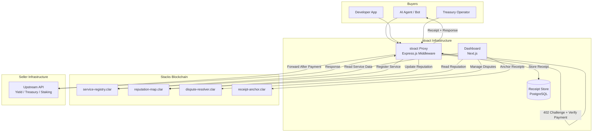
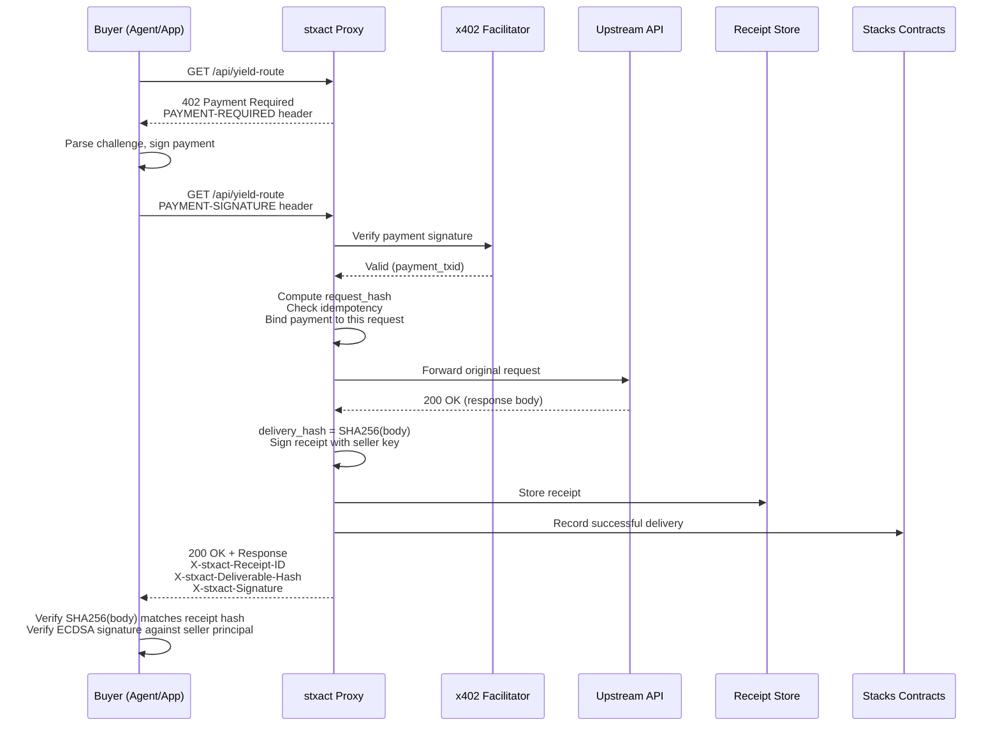
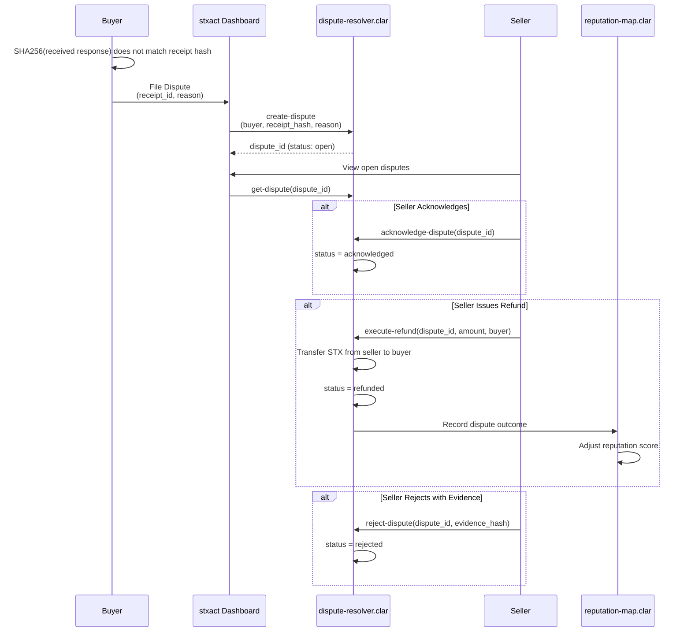
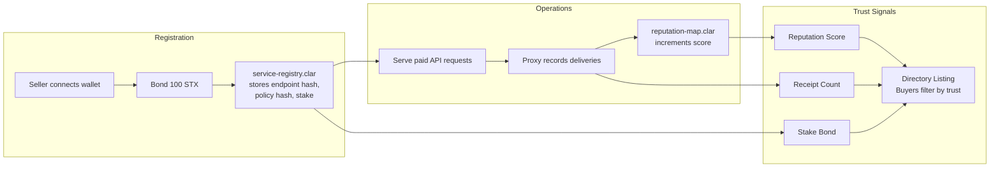

# stxact

**Trust & Settlement Fabric for x402 Services on Stacks**

stxact is a protocol layer that makes paid HTTP APIs (x402) accountable. It wraps any x402 endpoint with signed receipts, on-chain reputation, delivery verification, and dispute rails so that agents, institutions, and developers can pay for Bitcoin DeFi services without blindly trusting the operator.

## Why stxact Exists

The x402 protocol lets any HTTP endpoint require payment before serving content. But paying does not mean you got what you paid for.

When an autonomous agent pays 0.1 sBTC for a yield simulation, there is no proof the endpoint ran the computation. When a treasury operator pays for a quote and gets a 500 error, there is no record of what happened. Service operators can spin up new identities to escape bad history.

**stxact closes these gaps:**

- Every paid request produces a **signed receipt** with a SHA-256 hash of the actual response. Buyers can verify they got the exact output the seller committed to.
- Reputation is **anchored to Stacks principals**, not domains. A seller cannot reset their track record by changing URLs.
- Disputes are handled **on-chain** through smart contracts. Refunds are real STX transfers, not promises.
- Receipts can be **anchored to the blockchain** for permanent, third-party verifiable proof.

## What It Does

| Feature | How It Works |
|---|---|
| **Signed Receipts** | Every paid request produces an ECDSA-signed receipt containing request hash, payment txid, seller identity, and a SHA-256 hash of the response body |
| **Delivery Verification** | Buyers hash the response they receive and compare it against the hash committed in the receipt. Match = verified delivery |
| **On-Chain Reputation** | Successful deliveries increment a seller's reputation score on the `reputation-map` contract. Score is public, permanent, and tied to their Stacks address |
| **Dispute Resolution** | Buyers file disputes referencing a receipt. Sellers can acknowledge, issue refunds (real STX transfers), or reject with evidence. All state changes happen on-chain |
| **Receipt Anchoring** | Receipt hashes can be submitted to `receipt-anchor.clar` for permanent blockchain proof. Useful for audit trails and compliance |
| **Service Directory** | Sellers register on-chain with a 100 STX stake bond. The directory shows stake amount, reputation score, policy hash, and active status |

## Architecture

stxact is a monorepo with four packages:

```
stxact/
  packages/
    contracts/     Clarity smart contracts (Stacks blockchain)
    proxy/         Express.js middleware and API server
    webapp/        Next.js frontend dashboard
    cli/           Command-line interface (planned)
  infra/           Docker, migrations, Terraform configs
  docs/            PRD, deployment guides, API docs
  scripts/         Database migration scripts
```

### System Overview



### Payment Flow

How a single paid API call produces a verifiable, signed receipt with delivery proof.



### Dispute Resolution

When delivery verification fails, buyers file disputes that resolve on-chain.



### Registration and Reputation

Sellers bond STX to register. Reputation builds over time from verified deliveries.



## Smart Contracts

All contracts are Clarity v2, deployed on Stacks testnet.

| Contract | What It Does | Key Functions |
|---|---|---|
| `service-registry` | Stores seller registrations with a 100 STX minimum stake bond | `register-service`, `update-service`, `get-service`, `deactivate-service` |
| `reputation-map` | Tracks delivery count, dispute count, and reputation score per seller. Manages signing key versions | `record-successful-delivery`, `record-dispute`, `rotate-signing-key`, `get-reputation` |
| `dispute-resolver` | Handles the full dispute lifecycle: creation, acknowledgement, refund (real STX transfer), rejection | `create-dispute`, `acknowledge-dispute`, `execute-refund`, `reject-dispute` |
| `receipt-anchor` | Stores receipt hashes on-chain for permanent proof that a receipt existed at a specific block height | `anchor-receipt`, `get-anchor`, `verify-anchor` |

## Getting Started

### Prerequisites

- Node.js >= 18
- npm >= 9
- [Clarinet](https://github.com/hirosystems/clarinet) (for contract development)
- [Leather Wallet](https://leather.io/) (for testnet interaction)

### Installation

```bash
git clone https://github.com/your-org/stxact.git
cd stxact
npm install
```

### Run the Frontend

```bash
cd packages/webapp
cp .env.example .env.local
npm run dev
```

Open `http://localhost:3000` and connect your Leather wallet (testnet mode).

### Run the Proxy

```bash
cd packages/proxy
cp .env.example .env
npm run dev
```

### Deploy Contracts to Testnet

See [docs/TESTNET_DEPLOYMENT_GUIDE.md](docs/TESTNET_DEPLOYMENT_GUIDE.md) for the full walkthrough.

```bash
cd packages/contracts
clarinet deployments apply -p deployments/default.testnet-plan.yaml
```

## Environment Variables

Copy `.env.example` to `.env.local` (webapp) or `.env` (proxy) and set:

| Variable | What It Is |
|---|---|
| `NEXT_PUBLIC_STACKS_API_URL` | Stacks node API (default: `https://api.testnet.hiro.so`) |
| `NEXT_PUBLIC_STACKS_NETWORK` | `testnet` or `mainnet` |
| `NEXT_PUBLIC_SERVICE_REGISTRY` | Deployed `service-registry` contract address |
| `NEXT_PUBLIC_REPUTATION_MAP` | Deployed `reputation-map` contract address |
| `NEXT_PUBLIC_DISPUTE_RESOLVER` | Deployed `dispute-resolver` contract address |
| `NEXT_PUBLIC_RECEIPT_ANCHOR` | Deployed `receipt-anchor` contract address |

## Project Structure

```
packages/
  contracts/
    contracts/
      service-registry.clar    Seller registration, staking, directory
      reputation-map.clar      Reputation scores, key rotation, delivery tracking
      dispute-resolver.clar    Dispute lifecycle, refund execution
      receipt-anchor.clar      On-chain receipt hash storage
    settings/
      Testnet.toml             Testnet deployment config
  proxy/
    src/
      middleware/
        x402-payment-gate.ts   x402 payment verification + replay protection
        receipt-generator.ts   Receipt creation and ECDSA signing
      crypto/
        payment-binding.ts     Binds a payment txid to a specific request (prevents reuse)
        request-hash.ts        Hashes request method + path + body + timestamp
      storage/
        receipts.ts            Receipt persistence (PostgreSQL)
      config/
        logger.ts              Winston logger
  webapp/
    src/
      app/(app)/
        seller/                Seller dashboard (registration, metrics, key rotation)
        disputes/              Dispute listing and resolution panel
        receipts/              Receipt viewer and signature verification
        directory/             Service directory browser
        audit/                 Audit trail viewer
      hooks/
        useService.ts          Fetches seller data from service-registry + reputation-map
        useWallet.ts           Stacks wallet connection
        useDisputes.ts         Dispute data
        useReceipts.ts         Receipt data
      providers/
        WalletProvider.tsx     Stacks Connect wallet context
      components/
        GlassCard.tsx          Glassmorphism UI cards
        MetricTile.tsx         Dashboard metric tiles
        VerificationRow.tsx    Receipt verification rows
```

## Roadmap

### Phase 1: Foundation (Done)
- [x] 4 Clarity smart contracts deployed to testnet
- [x] x402 payment gate middleware with replay protection
- [x] Proxy server with receipt generation
- [x] Frontend dashboard with Leather wallet integration
- [x] On-chain seller registration with 100 STX bond
- [x] Live reputation score and key version display
- [x] Dispute filing, acknowledgement, refund, and rejection

### Phase 2: Trust Hardening (In Progress)
- [ ] Full delivery proof verification in the proxy (hash comparison on every response)
- [ ] Receipt PDF/CSV export with audit bundles
- [ ] Automatic reputation updates after each proxied request
- [ ] BNS name resolution in the service directory
- [ ] CLI tool (`stxact curl`, `stxact verify-receipt`, `stxact dispute`)

### Phase 3: Production
- [ ] Mainnet contract deployment
- [ ] PostgreSQL receipt store with archival
- [ ] Rate limiting and abuse protection
- [ ] Multi-token support (sBTC, USDA)
- [ ] Webhook notifications for dispute events

### Phase 4: Ecosystem
- [ ] Agent SDK for autonomous service consumption
- [ ] Institutional audit export (SOC 2 compatible)
- [ ] Cross-service reputation aggregation
- [ ] Marketplace with reputation-weighted rankings
- [ ] Governance for dispute arbitration thresholds

## Docs

| Document | What It Covers |
|---|---|
| [docs/PRD.md](docs/PRD.md) | Full product requirements |
| [docs/QUICK_START_TESTNET.md](docs/QUICK_START_TESTNET.md) | Testnet quickstart |
| [docs/QUICK_START_X402.md](docs/QUICK_START_X402.md) | x402 integration quickstart |
| [docs/TESTNET_DEPLOYMENT_GUIDE.md](docs/TESTNET_DEPLOYMENT_GUIDE.md) | Contract deployment walkthrough |
| [docs/PRD_X402_SECTION.md](docs/PRD_X402_SECTION.md) | x402 protocol integration spec |

## Tech Stack

| Layer | Technology |
|---|---|
| Blockchain | Stacks (Bitcoin L2), Clarity v2 |
| Proxy | Express.js, x402-stacks, Winston |
| Frontend | Next.js 15, React 19, TanStack Query |
| Wallet | @stacks/connect-react, Leather |
| Styling | Vanilla CSS (custom design system) |
| Database | PostgreSQL (production), SQLite (dev) |
| Infrastructure | Docker, Terraform |

## License

MIT
