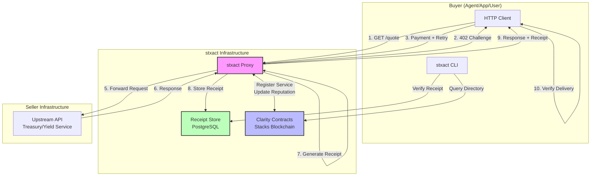
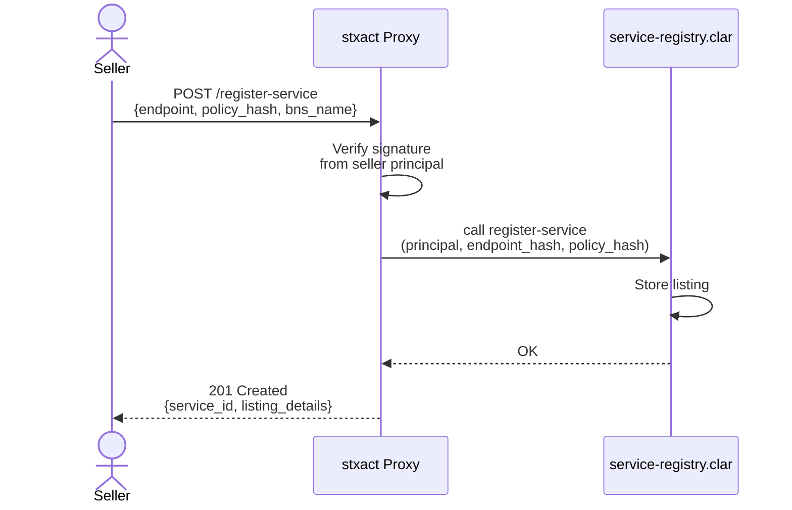
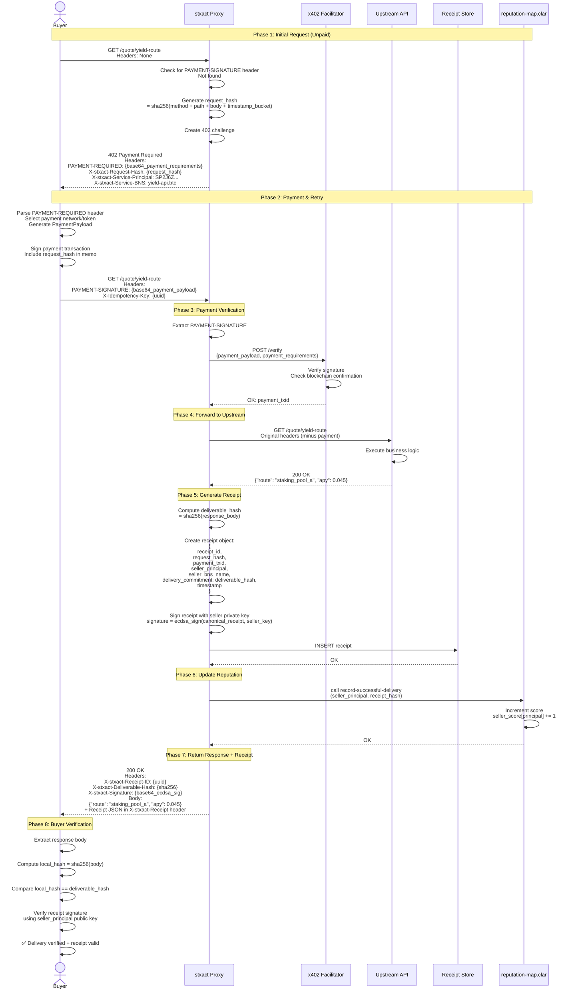
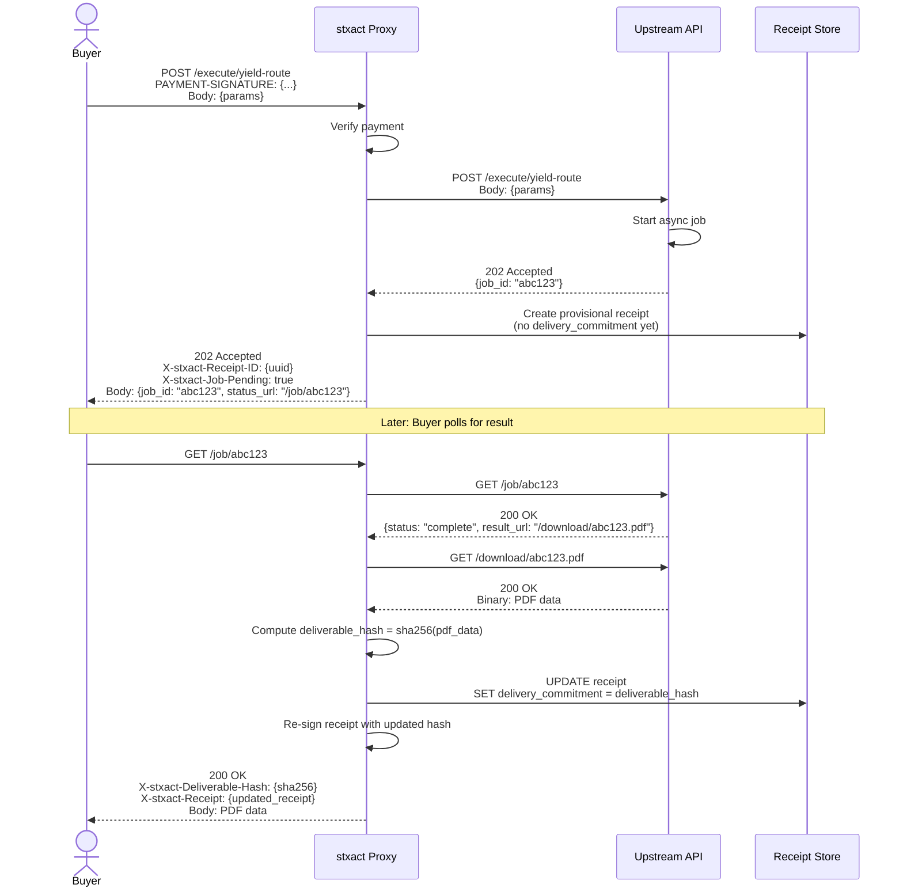
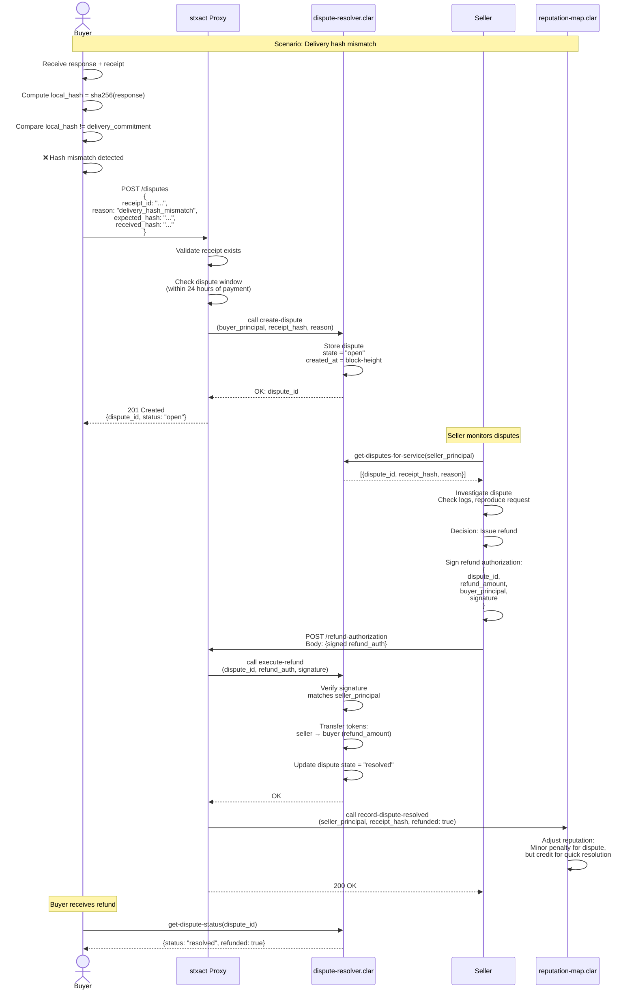
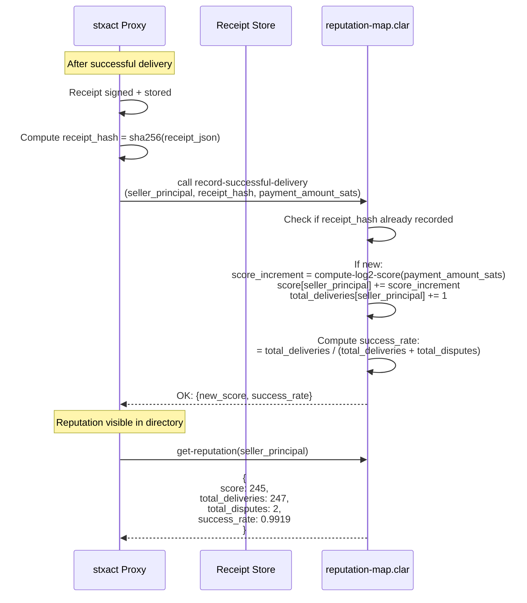
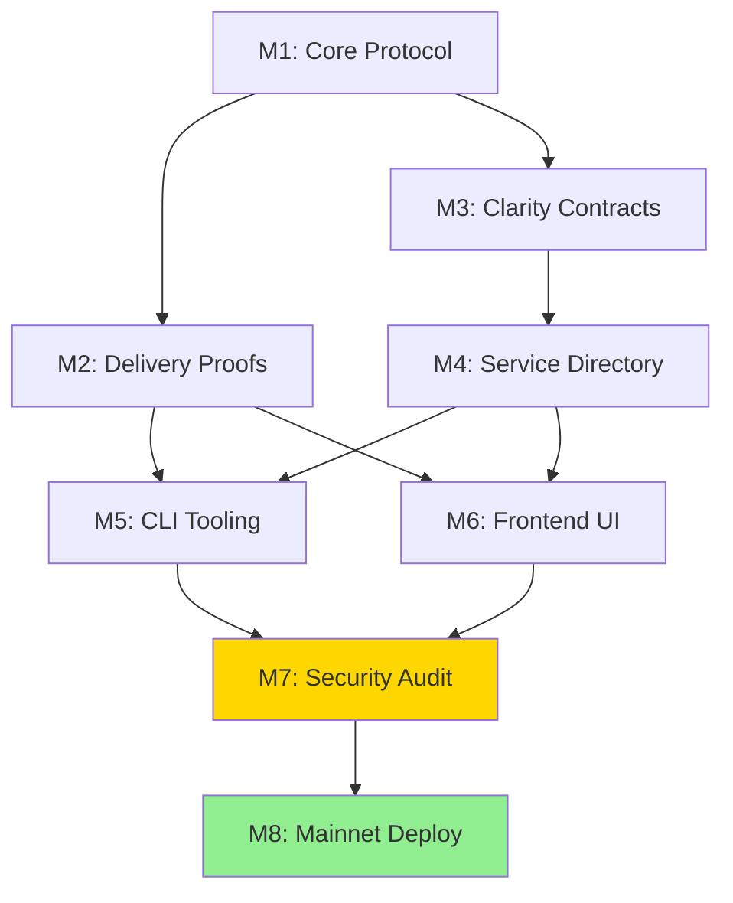

# stxact: Trust & Settlement Fabric for x402 Services on Stacks

## 1. Executive Summary

stxact is a trust and settlement infrastructure layer for x402-enabled services on the Stacks blockchain. It transforms x402 payment endpoints into verifiable services with portable reputation, cryptographic delivery proofs, and dispute-safe receipts. stxact enables agents and institutions to programmatically pay for Bitcoin DeFi operations, treasury actions, and yield services over HTTP without trusting individual service operators.

**Core Primitive**: stxact is not a vault, marketplace application, or payment processor. It is a composable trust standard—a protocol-level primitive that future BTCFi protocols, treasury management APIs, and autonomous agent services build on top of.

**Trust Model**: stxact is a trust fabric with a trusted relay (the stxact proxy), not a fully decentralized reputation system. The proxy is responsible for receipt generation, payment verification, and reputation submission to on-chain contracts. For institutional-grade trust, services must enable on-chain receipt anchoring to provide third-party verifiable proof of reputation basis. This hybrid approach balances cryptographic verifiability (all receipts are signed, all transactions are on-chain) with operational efficiency (full receipt data stored off-chain with optional anchoring).

**Non-Goals**:
- Not a FlowVault-style liquidity vault or yield aggregator
- Not a centralized marketplace operator (Etsy/Upwork clone)
- Not an x402 payment facilitator (payment settlement remains with existing x402 infrastructure)
- Not a general dispute arbitration court (provides deterministic dispute rails, not subjective judgments)
- Not a replacement for existing authentication or authorization systems

## 2. Problem Statement

The x402 protocol[^1] solves the payment challenge for internet-native services: it enables any HTTP endpoint to require payment before serving content, with payments settling in approximately 2 seconds on blockchain rails[^2]. However, x402 only handles the payment trigger—it does not address the trust gaps that emerge when payments are separated from delivery guarantees:

**Trust Gaps x402 Does Not Solve**:

1. **Delivery Verification**: When an agent pays 0.1 sBTC for a "yield optimization simulation," how does it verify the endpoint actually performed the computation versus returning cached or fabricated data?

2. **Non-Repudiation**: If a treasury operator pays for a quote but the endpoint returns a 500 error, there is no cryptographic proof of what was requested, what was paid, or what was delivered.

3. **Sybil Reputation Resets**: Service operators can spin up new domains and principals to escape negative reputation, making it impossible for buyers to distinguish trustworthy services from scams.

4. **Audit Trail for Institutions**: Enterprises using paid APIs for productive Bitcoin treasury operations[^3] need auditable receipts with identity anchoring, not just transaction hashes.

5. **Dispute Resolution Primitives**: When delivery fails or results are disputed, there is no standard mechanism for refunds or resolution that doesn't require manual intervention or trusted intermediaries.

These gaps prevent the adoption of x402 services in high-stakes contexts where institutional capital, autonomous agents, and productive BTC treasuries[^4] operate. stxact fills this missing layer by making x402 endpoints verifiable, accountable, and reputation-bound.

**Industry Context**: Stacks is explicitly targeting self-custodial BTC staking, earn vaults, productive treasuries, and institutional rails via Fireblocks integration[^5]. These use cases demand trustworthy service endpoints with receipts, delivery proofs, and portable reputation—stxact provides the standard infrastructure for this trust layer.

## 3. User Personas and Primary Jobs-To-Be-Done

### Persona 1: API Seller (Service Provider)

**Description**: Developer or organization operating an x402-enabled service endpoint (e.g., yield simulation API, treasury allocation optimizer, BTC staking validator).

**Primary JTBD**:
- Prove delivery of services to avoid false dispute claims
- Build portable reputation that survives domain/infrastructure changes
- Monetize expertise without building custom receipt/reputation systems
- Comply with audit requirements for institutional clients

**Pain Points Solved**:
- Eliminates "he said, she said" disputes with cryptographic delivery proofs
- Reputation anchored to Stacks principal (cannot be reset by changing domains)
- Plug-in solution: add stxact headers to existing x402 endpoints without rewriting business logic

### Persona 2: API Buyer (Developer/Application)

**Description**: Developer building applications that consume paid x402 services (e.g., DeFi aggregator calling multiple yield APIs, agent framework paying for data feeds).

**Primary JTBD**:
- Verify service delivery before trusting results in downstream logic
- Filter services by reputation to avoid scams or unreliable providers
- Maintain audit trail of paid transactions for compliance or debugging
- Dispute failed deliveries without manual email exchanges

**Pain Points Solved**:
- Receipts provide cryptographic proof of payment + delivery commitment
- Directory filtering by reputation score reduces risk of bad actors
- Automated dispute flow with deterministic refund conditions

### Persona 3: Agent/Bot Buyer

**Description**: Autonomous AI agent or trading bot executing programmatic transactions without human intervention.

**Primary JTBD**:
- Discover services via machine-readable directory
- Verify delivery without human judgment (hash-based validation)
- Operate within budget constraints using reputation as a trust proxy
- Handle failures gracefully with automated refund claims

**Pain Points Solved**:
- `.well-known` discovery endpoint returns structured service metadata
- Delivery proof validation is deterministic (hash comparison)
- Reputation scores allow programmatic risk assessment

### Persona 4: Institution/Treasury Operator

**Description**: Corporate treasurer or DAO governance managing large BTC/sBTC allocations, procuring yield strategies or staking services via APIs.

**Primary JTBD**:
- Obtain auditable records of all paid service interactions
- Enforce vendor reputation thresholds in procurement policies
- Demonstrate due diligence to auditors and regulators
- Recover funds from failed transactions via dispute mechanisms

**Pain Points Solved**:
- Receipts contain Stacks principal identity + optional BNS name resolution
- All receipts exportable as structured audit logs
- Dispute flow generates refund authorizations that can be validated by compliance systems

### Persona 5: Auditor/Compliance Officer

**Description**: Third-party auditor reviewing treasury operations, smart contract interactions, or service procurement records.

**Primary JTBD**:
- Verify authenticity of receipts and delivery proofs
- Trace payments to specific service principals and BNS identities
- Validate dispute resolutions and refund authorizations
- Confirm compliance with institutional policies (e.g., only use vendors with reputation > X)

**Pain Points Solved**:
- Receipt signature verification is independent of stxact infrastructure
- Delivery commitments are immutable once signed
- Reputation scores are derived from on-chain anchored events, not self-reported metrics

## 4. Core Concepts and Glossary

**Receipt**: A cryptographically signed data structure attesting to a completed x402 payment and the service's commitment to deliver. Contains: request hash, payment transaction ID, seller identity, service commitment signature, and optional delivery commitment hash.

**Request Hash**: Deterministic hash of the HTTP request (method + path + body hash + timestamp bucket + optional nonce). Used for replay protection and idempotency enforcement.

**Deliverable Hash**: SHA-256 hash of the response payload or output artifact. Allows buyers to verify they received the committed output without the service revealing the full result publicly.

**Service Identity**: The Stacks principal (e.g., `SP2J6ZY48GV1EZ5V2V5RB9MP66SW86PYKKNRV9EJ7`) and optionally a BNS name (e.g., `yield-api.btc`) that uniquely identifies the service operator. Identity is bound to the signing key used to generate receipts.

**Seller Signature**: ECDSA signature over the canonical receipt structure using the service operator's Stacks private key. Proves the receipt originated from the claimed principal.

**Service Commitment**: The seller's signed attestation that they will deliver the specified service in exchange for the received payment. This commitment is part of the receipt and is non-repudiable.

**Delivery Commitment**: For endpoints where the outcome is an artifact (e.g., a report, simulation result, or generated data), the seller includes the hash of the deliverable in the receipt. Buyer can later verify the received artifact matches the committed hash.

**Dispute**: A formal claim by a buyer that a service failed to deliver as committed. Disputes reference a specific receipt ID and must be created within a configurable time window after payment.

**Refund Authorization**: A signed message from the seller authorizing a refund to the buyer. Can be executed by a Clarity smart contract that transfers tokens back to the buyer if the authorization is valid.

**Reputation Event**: A deterministic update to a service's reputation score derived from receipts and dispute outcomes. Events include: successful delivery, disputed delivery, resolved dispute (refund issued), abnormal failure rate.

**Service Policy**: A JSON document published by the seller defining SLAs, retry windows, refund conditions, supported tokens, and timeout parameters. Hashed and anchored on-chain for immutability.

**Directory Listing**: Metadata about a service registered in the stxact Clarity contract. Includes: endpoint URL, service policy hash, identity (principal + BNS), reputation snapshot, supported tokens, pricing metadata.

**Facilitator**: An x402 payment facilitator (e.g., Coinbase's hosted service) that handles payment verification and settlement. stxact is facilitator-agnostic—it works with any compliant x402 facilitator[^6]. 

**Confirmation Depth**: Minimum number of blockchain confirmations required before a payment is considered final. Configurable per deployment:
- **Testnet**: 1 block (default)
- **Mainnet**: 6 blocks (default)
- Receipts must include `block_height` and `block_hash` of the confirmation block to enable independent verification

**Idempotency Key**: HTTP header (`X-Idempotency-Key`) used to prevent duplicate processing of the same request. Critical for ensuring retries don't charge the buyer multiple times.

**Timestamp Bucket**: Request timestamps are rounded to the nearest N-second interval (default: 300 seconds) to prevent minor clock drift from breaking hash consistency while still providing replay protection.

**stxact Proxy**: The Node.js or edge runtime service that sits in front of upstream APIs, enforces x402 payment requirements, generates receipts, validates delivery, and interfaces with Clarity contracts.

## 5. System Architecture

### Components

**stxact Proxy (Node/Edge Runtime)**:
- Express.js middleware or edge runtime handler (Cloudflare Workers/Vercel Edge)
- Enforces x402 payment challenges and verifies payment proofs
- Generates cryptographic receipts with seller signatures
- Forwards requests to upstream service APIs
- Validates delivery proofs (hash comparison)
- Stores receipts in durable storage (SQLite for dev, PostgreSQL for production)
- Interfaces with Clarity contracts for reputation updates and directory listings

**Upstream Service API**:
- The actual business logic endpoint (e.g., yield simulation, treasury optimizer, staking validator)
- Unaware of stxact (no code changes required)
- Receives forwarded requests from the proxy after payment verification
- Returns responses that the proxy wraps with delivery commitments

**Clarity Smart Contracts**:
- `service-registry.clar`: Manages service directory listings, registration, and updates
- `receipt-anchor.clar` (optional): Stores hashes of receipts on-chain for immutability and third-party verification
- `reputation-map.clar`: Maintains reputation scores per service principal, updated via signed receipt submissions
- `dispute-resolver.clar`: Handles dispute creation, resolution, and refund authorization execution

**Receipt Store (Database)**:
- PostgreSQL for production, SQLite for local development
- Stores full receipt data, indexed by receipt ID, service principal, and buyer address
- Supports export to CSV/JSON for audit purposes
- Optional archival strategy (S3/IPFS) for long-term retention

**Optional Receipt Anchoring**:
- For high-trust scenarios, receipt hashes can be submitted to `receipt-anchor.clar`
- Provides on-chain proof that a receipt existed at a specific block height
- Enables third-party verification without trusting the proxy operator

**Frontend UI (Optional)**:
- Service directory browser (filter by reputation, token support, category)
- Receipt viewer/verifier (paste receipt JSON, verify signature + blockchain proof)
- Dispute dashboard (buyer: create disputes; seller: view/respond to disputes)
- Service detail pages (pricing, identity, reputation graph, usage examples)

**CLI Tool (`stxact`)**:
- Command-line interface for developers and agents
- `stxact curl <url>`: Make a 402-protected request, auto-pay on challenge, print receipt
- `stxact verify-receipt <receipt.json>`: Validate receipt signature and delivery proof
- `stxact dispute create <receipt-id> <reason>`: File a dispute
- `stxact list-services --min-rep 80`: Query directory with filters

### Architecture Diagram



### Data Flow: Service Registration



## 6. Protocol Flows

### Flow 1: Unpaid Request → 402 Challenge → Payment → Receipt

This is the core happy-path flow demonstrating how stxact extends x402 with trust primitives.



**HTTP Examples**:

Initial Request (Unpaid):
```http
GET /quote/yield-route HTTP/1.1
Host: api.yield-optimizer.btc
Accept: application/json
```

402 Challenge Response:
```http
HTTP/1.1 402 Payment Required
Content-Type: application/json
PAYMENT-REQUIRED: eyJhY2NlcHRzIjpbeyJuZXR3b3JrIjoic3RhY2tzIiwic2NoZW1lIjoiZXhhY3QiLCJhbW91bnQiOiIxMDAwMDAiLCJ0b2tlbiI6IlNQMkFTSlpIRUtDVjJNQkRZV1MxSFQ2M1dYWVdYNDlORi5zYnRjLXRva2VuIiwiYWRkcmVzcyI6IlNQMko2Wlk0OEdWMUVaNVYyVjVSQjlNUDY2U1c4NlBZS0tOUlY5RUo3In1dfQ==
X-stxact-Request-Hash: a7f3d2c9e8b1f4a6d5c3e9b2f7a8d1c4e6b9f3a2d8c5e1b7f4a9d3c6e2b8f5a1
X-stxact-Service-Principal: SP2J6ZY48GV1EZ5V2V5RB9MP66SW86PYKKNRV9EJ7
X-stxact-Service-BNS: yield-api.btc
X-stxact-Service-Policy-Hash: e3b0c44298fc1c149afbf4c8996fb92427ae41e4649b934ca495991b7852b855

{"error": "payment_required", "message": "Payment of 0.00001 sBTC required"}
```

Retry Request with Payment:
```http
GET /quote/yield-route HTTP/1.1
Host: api.yield-optimizer.btc
Accept: application/json
PAYMENT-SIGNATURE: eyJuZXR3b3JrIjoic3RhY2tzIiwic2NoZW1lIjoiZXhhY3QiLCJ0eGlkIjoiMHhh...
X-Idempotency-Key: 550e8400-e29b-41d4-a716-446655440000
```

Success Response with Receipt:
```http
HTTP/1.1 200 OK
Content-Type: application/json
X-stxact-Receipt-ID: 7c9e6679-7425-40de-944b-e07fc1f90ae7
X-stxact-Deliverable-Hash: b94d27b9934d3e08a52e52d7da7dabfac484efe37a5380ee9088f7ace2efcde9
X-stxact-Signature: MEUCIQCxB...
X-stxact-Receipt: eyJyZWNlaXB0X2lkIjoiN2M5ZTY2NzktNzQyNS00MGRlLTk0NGItZTA3ZmMx...

{
  "route": "stacking_pool_a",
  "apy": 0.045,
  "simulation": {
    "expected_yield_btc": 0.0023,
    "lock_period_days": 30
  }
}
```

### Flow 2: Delivery-Proof Endpoint (Asynchronous Job)

For services where the deliverable is generated asynchronously (e.g., a batch simulation, a report generation), the delivery proof mechanism works slightly differently.



**Design Constraint**: The provisional receipt initially has `delivery_commitment: null`. Once the job completes, the receipt is updated and re-signed. The receipt ID remains the same, but the signature changes. Buyers can verify both signatures to see the progression.

### Flow 3: Dispute Creation → Resolution → Refund



**Dispute States**:
- `open`: Dispute created, awaiting seller response
- `resolved`: Seller issued refund authorization, tokens transferred
- `expired`: Dispute window (e.g., 7 days) elapsed without resolution; buyer can escalate (future: DAO governance) or accept loss
- `rejected`: Seller provided counter-proof (e.g., logs showing correct delivery); buyer can accept or escalate

**Refund Authorization Schema**:
```typescript
interface RefundAuthorization {
  dispute_id: string;           // UUID of the dispute
  receipt_id: string;            // Original receipt ID
  refund_amount: string;         // Amount in smallest token unit (e.g., "100000" for 0.001 sBTC)
  buyer_principal: string;       // Stacks principal receiving refund
  seller_principal: string;      // Issuing service principal (prevents cross-service replay)
  timestamp: number;             // Unix timestamp
  signature: string;             // ECDSA signature over canonical message
}
```

Canonical Refund Message (for signature):
```
STXACT-REFUND:${dispute_id}:${receipt_id}:${refund_amount}:${buyer_principal}:${seller_principal}:${timestamp}
```

### Flow 4: Reputation Update from Receipts

Reputation is computed deterministically from on-chain or verifiable off-chain events. This flow shows how reputation increments after successful delivery.



**Reputation Events & Scoring**:

| Event | Score Delta | Notes |
|-------|-------------|-------|
| Successful delivery | +floor(log2(payment_sats + 1)) | Logarithmic weighting prevents micro-payment farming. 10k sats = +14, 100k sats = +17, 1M sats = +20. Only payments ≥ 10,000 sats count. |
| Disputed (unresolved) | -5 | Buyer filed dispute, seller did not respond |
| Disputed (resolved with refund) | -2 | Seller acknowledged issue, issued refund |
| Abnormally high failure rate | -10 (off-chain advisory) | If >10% of requests return 5xx errors in 24h window |
| Stake-to-serve bond posted | +10 (one-time) | Seller locks STX as collateral |

**Logarithmic Reputation Weighting**:

Reputation score increments are computed as `floor(log2(payment_amount_sats + 1))`. This creates the following scaling:

- 10,000 sats (minimum) → +14 points
- 50,000 sats → +16 points
- 100,000 sats (0.001 sBTC) → +17 points
- 500,000 sats (0.005 sBTC) → +19 points
- 1,000,000 sats (0.01 sBTC) → +20 points
- **>1,048,575 sats (>0.010 sBTC) → capped at +21 points**

**Hard Cap**: The current Clarity implementation caps the score increment at u21 for payments exceeding 1,048,575 sats (~0.010 sBTC). This is an intentional design decision to:
1. Prevent score inflation from extremely large single payments
2. Encourage consistent service delivery over time rather than one-off large transactions
3. Simplify Clarity implementation (full unbounded log2 requires complex bit-shifting)

**Exact Payment Buckets**:
- Payments from 524,288 to 1,048,575 sats (0.005 - 0.010 sBTC) → +20 points
- Payments ≥ 1,048,576 sats (≥ 0.010 sBTC) → **capped at +21 points**

This means a 0.010 sBTC payment and a 10 BTC payment both receive the maximum +21 score increment. The hard cap applies at the 2^20 satoshi threshold (1,048,576 sats).

**Rationale**: Institutional payments of 1 BTC (100M sats) and 0.1 BTC (10M sats) both receive the maximum +21 score increment. This prevents reputation concentration and ensures that reputation reflects consistent delivery history, not payment size alone. Services must earn reputation through repeated successful deliveries, not single large transactions.

**Future Consideration**: If uncapped logarithmic scoring is required, the contract can be upgraded to implement full log2 via bit-shifting algorithms, though this increases gas costs significantly.

**Rationale**: Linear scoring (+1 per delivery regardless of amount) allows attackers to farm reputation cheaply by making thousands of minimal payments. Logarithmic scaling rewards larger transactions while making micro-payment spam economically infeasible. An attacker would need to spend exponentially more to achieve the same score increase.

**Units**: Satoshis (smallest unit of sBTC)

**Rounding**: Floor function (integer division)

**Anti-gaming note**: The logarithmic curve means doubling payment amount only increases score by ~1 point. This prevents both micro-payment spam and excessive score concentration from single large payments.

**Implementation**: The `record-successful-delivery` Clarity function accepts `payment-amount-sats` as an argument and enforces the minimum threshold (10,000 sats) on-chain before computing the logarithmic score increment.

**Anti-Sybil Constraint**: Services must lock a minimum STX bond (e.g., 100 STX) to register in the directory. Bond is slashed if fraud is proven (e.g., forged signatures, systematic delivery failures). This prevents spinning up infinite identities to farm fake reputation.

**Abnormal Failure Rate Penalty**: The -10 penalty for high failure rates (>10% 5xx errors in 24h) is an **off-chain advisory** metric. It is computed by the stxact proxy based on monitoring data and reflected in the directory UI, but is not enforced on-chain. Services with abnormal failure rates may be flagged or filtered out by clients, but their on-chain reputation score is only affected by recorded deliveries and disputes.

**Reputation Anchoring Trust Boundary**:

Reputation scores are stored on-chain in the `reputation` map, but the reputation is derived from the `recorded-receipts` map, which tracks receipt hashes submitted by the proxy. This creates a trust dependency:

**Trust Model**:
1. **On-Chain**: Reputation scores and recorded receipt hashes are stored in Clarity contracts (immutable, verifiable)
2. **Off-Chain**: Full receipt data (JSON objects) are stored in the proxy's PostgreSQL database
3. **Trust Point**: The proxy is trusted to honestly submit receipt hashes to the `recorded-receipts` map after verifying payment transactions

**Vulnerability**: If the proxy database is corrupted or lost, full receipt data disappears, but reputation scores remain on-chain. This could make it impossible to audit the historical basis for a service's reputation.

**Mitigation Options**:

**Option A: Database-Backed Reputation (Minimum Viable)**:
- Accept proxy database as the authoritative receipt store
- Implement robust backup/replication (daily S3 snapshots, standby replica)
- Provide receipt export functionality for users to maintain their own archives
- Trust assumption: Proxy operator maintains data integrity
- **Use Case**: Development, testing, low-stakes consumer services

**Option B: Anchored Reputation (Institutional-Grade)**:
- Services **SHOULD** anchor receipt hashes to the `receipt-anchors` Clarity map for institutional-grade trust
- Anchoring provides on-chain proof that a receipt existed at a specific block height
- Third parties can verify reputation by cross-referencing on-chain anchored receipts
- Anchoring requires a small fee (e.g., 0.01 STX per receipt) to prevent spam
- **Use Case**: Institutional treasury operations, high-value transactions, regulatory compliance, audited services

**Normative Requirement for Institutional Use**: Services targeting institutional clients, treasury operations, or requiring regulatory compliance **MUST** enable receipt anchoring. Anchoring is not optional for institutional-grade trust—it is the only mechanism that provides immutable, third-party verifiable proof that reputation scores are derived from legitimate receipts.

**Production Recommendation**: 
- Consumer/retail services: Option A (database-backed) for cost efficiency
- Institutional/regulated services: Option B (anchored) is mandatory
- High-value services (>10 BTC total payments): Option B strongly recommended
- The stxact directory UI should flag services that do not use anchoring for institutional contexts

**Payment Amount Verification Flow**: 

When the proxy calls `record-successful-delivery`, it must:
1. Query the Stacks blockchain for the payment transaction referenced by `payment_txid`
2. Extract the token transfer amount from the transaction data
3. Submit both `receipt_hash` AND `payment_amount_sats` to the on-chain contract
4. The Clarity contract validates the payment amount meets the minimum threshold before crediting reputation

This ensures malicious proxies cannot inflate reputation by submitting receipts with falsified payment amounts. The on-chain contract is the source of truth for payment verification.

## 7. API Specification

All API endpoints are exposed by the stxact Proxy. Sellers integrate by adding middleware; buyers consume via HTTP clients or the stxact CLI.

### Endpoint: `.well-known/stxact-config`

**Purpose**: Discovery endpoint for stxact capabilities, service policy, and supported features.

**Method**: `GET`

**Path**: `/.well-known/stxact-config`

**Auth**: None (public)

**Response Schema**:
```json
{
  "version": "1.0.0",
  "service_principal": "SP2J6ZY48GV1EZ5V2V5RB9MP66SW86PYKKNRV9EJ7",
  "service_bns_name": "yield-api.btc",
  "policy_hash": "e3b0c44298fc1c149afbf4c8996fb92427ae41e4649b934ca495991b7852b855",
  "policy_url": "https://api.yield-optimizer.btc/policy.json",
  "features": {
    "delivery_proofs": true,
    "async_jobs": true,
    "dispute_resolution": true,
    "receipt_anchoring": false
  },
  "supported_tokens": [
    {
      "network": "stacks",
      "token_contract": "SP2ASJZHEKV2MBDYWS1HT63WXYXWX49NF.sbtc-token",
      "symbol": "sBTC"
    },
    {
      "network": "stacks",
      "token_contract": "SP3K8BC0PPEVCV7NZ6QSRWPQ2JE9E5B6N3PA0KBR9.token-usdcx",
      "symbol": "USDCx"
    }
  ],
  "reputation": {
    "score": 245,
    "total_deliveries": 247,
    "total_disputes": 2,
    "success_rate": 0.9919
  },
  "endpoints": [
    {
      "path": "/quote/yield-route",
      "method": "GET",
      "price_sbtc_sats": "10000",
      "description": "Generate yield optimization quote"
    },
    {
      "path": "/execute/yield-route",
      "method": "POST",
      "price_sbtc_sats": "100000",
      "description": "Execute yield route allocation"
    }
  ]
}
```

**Errors**:
- `404 Not Found`: stxact not enabled for this service

### Endpoint: Verify Receipt

**Purpose**: Validate a receipt's cryptographic signature and optional on-chain anchor.

**Method**: `POST`

**Path**: `/receipts/verify`

**Auth**: None (public)

**Request Schema**:
```json
{
  "receipt": {
    "receipt_id": "7c9e6679-7425-40de-944b-e07fc1f90ae7",
    "request_hash": "a7f3d2c9e8b1f4a6d5c3e9b2f7a8d1c4e6b9f3a2d8c5e1b7f4a9d3c6e2b8f5a1",
    "payment_txid": "0xabc123...",
    "seller_principal": "SP2J6ZY48GV1EZ5V2V5RB9MP66SW86PYKKNRV9EJ7",
    "seller_bns_name": "yield-api.btc",
    "buyer_principal": "SP1HTBVD3JG9C05J7HBJTHGR0GGW7KXW28M5JS8QE",
    "delivery_commitment": "b94d27b9934d3e08a52e52d7da7dabfac484efe37a5380ee9088f7ace2efcde9",
    "timestamp": 1735699200,
    "block_height": 123456,
    "block_hash": "0xabc123blockhash",
    "key_version": 1,
    "revision": 0,
    "service_policy_hash": "e3b0c44298fc1c149afbf4c8996fb92427ae41e4649b934ca495991b7852b855",
    "signature": "MEUCIQCxB..."
  }
}
```

**Response Schema**:
```json
{
  "valid": true,
  "checks": {
    "signature_valid": true,
    "principal_match": true,
    "payment_txid_confirmed": true,
    "receipt_hash_anchored": false
  },
  "details": {
    "seller_bns_resolved": true,
    "bns_owner": "SP2J6ZY48GV1EZ5V2V5RB9MP66SW86PYKKNRV9EJ7",
    "payment_block_height": 123456
  }
}
```

**Errors**:
- `400 Bad Request`: Malformed receipt JSON
- `422 Unprocessable Entity`: Signature verification failed

### Endpoint: Lookup Receipt

**Purpose**: Retrieve a stored receipt by ID.

**Method**: `GET`

**Path**: `/receipts/{receipt_id}`

**Auth**: Optional (publicly readable by default; can be restricted to buyer/seller only)

**Response Schema**: Same as receipt object in "Verify Receipt"

**Errors**:
- `404 Not Found`: Receipt ID does not exist
- `403 Forbidden`: Access restricted to buyer/seller

### Endpoint: List Services (Directory)

**Purpose**: Query the service directory with filters.

**Method**: `GET`

**Path**: `/directory/services`

**Auth**: None (public)

**Query Parameters**:
- `min_reputation` (integer, optional): Minimum reputation score (default: 0)
- `supported_token` (string, optional): Filter by token contract address
- `category` (string, optional): Service category (e.g., "yield", "staking", "oracle")
- `limit` (integer, optional): Max results per page (default: 50, max: 200)
- `offset` (integer, optional): Pagination offset

**Response Schema**:
```json
{
  "services": [
    {
      "service_id": "uuid",
      "principal": "SP2J6ZY48GV1EZ5V2V5RB9MP66SW86PYKKNRV9EJ7",
      "bns_name": "yield-api.btc",
      "endpoint_url": "https://api.yield-optimizer.btc",
      "policy_hash": "e3b0c44...",
      "reputation": {
        "score": 245,
        "success_rate": 0.9919
      },
      "supported_tokens": ["sBTC", "USDCx"],
      "category": "yield",
      "registered_at": 1700000000
    }
  ],
  "pagination": {
    "total": 15,
    "limit": 50,
    "offset": 0
  }
}
```

### Endpoint: Register Service

**Purpose**: Add a new service to the directory.

**Method**: `POST`

**Path**: `/directory/register`

**Auth**: Signed request (seller must sign message with their Stacks key)

**Request Schema**:
```json
{
  "endpoint_url": "https://api.yield-optimizer.btc",
  "policy_hash": "e3b0c44...",
  "bns_name": "yield-api.btc",
  "category": "yield",
  "supported_tokens": [
    {
      "network": "stacks",
      "token_contract": "SP2ASJZHEKV2MBDYWS1HT63WXYXWX49NF.sbtc-token",
      "symbol": "sBTC"
    }
  ],
  "signature": "MEQCIFz..."  // Signature over canonical message
}
```

**Canonical Registration Message**:
```
STXACT-REGISTER:${endpoint_url_hash}:${policy_hash}:${bns_name}:${timestamp}
```

**Response Schema**:
```json
{
  "service_id": "uuid",
  "status": "registered",
  "tx_hash": "0xdef456..."  // Clarity contract call transaction
}
```

**Errors**:
- `400 Bad Request`: Missing required fields
- `409 Conflict`: Principal already registered
- `422 Unprocessable Entity`: Invalid signature

### Endpoint: Create Dispute

**Purpose**: File a dispute for a failed or incorrect delivery.

**Method**: `POST`

**Path**: `/disputes`

**Auth**: Signed request (buyer signature)

**Request Schema**:
```json
{
  "receipt_id": "7c9e6679-7425-40de-944b-e07fc1f90ae7",
  "reason": "delivery_hash_mismatch",
  "evidence": {
    "expected_hash": "abc123...",
    "received_hash": "def456...",
    "notes": "Response body does not match delivery commitment"
  },
  "buyer_signature": "MEUCIQDy..."
}
```

**Response Schema**:
```json
{
  "dispute_id": "uuid",
  "status": "open",
  "created_at": 1735699200,
  "resolution_deadline": 1736304000
}
```

**Errors**:
- `400 Bad Request`: Invalid receipt_id or missing fields
- `409 Conflict`: Dispute already exists for this receipt
- `422 Unprocessable Entity`: Outside dispute window

### Endpoint: Get Dispute Status

**Method**: `GET`

**Path**: `/disputes/{dispute_id}`

**Auth**: Public (read-only)

**Response Schema**:
```json
{
  "dispute_id": "uuid",
  "receipt_id": "7c9e6679-7425-40de-944b-e07fc1f90ae7",
  "status": "resolved",
  "reason": "delivery_hash_mismatch",
  "refund_issued": true,
  "refund_amount": "10000",
  "refund_txid": "0xghi789...",
  "created_at": 1735699200,
  "resolved_at": 1735785600
}
```

### Endpoint: Submit Refund Authorization (Seller)

**Method**: `POST`

**Path**: `/refunds`

**Auth**: Seller signature

**Request Schema**:
```json
{
  "dispute_id": "uuid",
  "receipt_id": "7c9e6679-7425-40de-944b-e07fc1f90ae7",
  "refund_amount": "10000",
  "buyer_principal": "SP1HTBVD3JG9C05J7HBJTHGR0GGW7KXW28M5JS8QE",
  "timestamp": 1735699200,
  "seller_signature": "MEQCIH..."
}
```

**Response Schema**:
```json
{
  "status": "executed",
  "tx_hash": "0xjkl012...",
  "dispute_status": "resolved"
}
```

## 8. Receipt Format (Canonical, Verifiable)

The receipt is a JSON object with a defined canonical form for signature generation. Signature is computed over the canonical representation to ensure deterministic verification.

### Receipt Schema

```typescript
interface Receipt {
  receipt_id: string;             // UUIDv4
  request_hash: string;           // SHA-256 hex, lowercase
  payment_txid: string;           // Blockchain transaction ID
  seller_principal: string;       // Stacks principal (SP... or SM...)
  seller_bns_name?: string;       // Optional BNS name
  buyer_principal?: string;       // Optional buyer identity
  delivery_commitment?: string;   // SHA-256 hex of deliverable, lowercase
  timestamp: number;              // Unix timestamp (seconds)
  block_height: number;           // Block height at payment confirmation
  block_hash: string;             // Block hash at payment confirmation
  key_version: number;            // Signing key version (for rotation support)
  revision: number;               // Receipt revision number (0 = initial, 1+ = updated)
  service_policy_hash?: string;   // SHA-256 hex of service policy JSON
  metadata?: {                    // Optional additional fields
    endpoint: string;             // e.g., "GET /quote/yield-route"
    price_sats: string;           // Payment amount in satoshis
    token_contract: string;       // Stacks token contract address
  };
  signature: string;              // ECDSA signature, base64-encoded
}
```

### Canonicalization Algorithm

To generate a consistent signature, the receipt fields are serialized into a canonical message string. The algorithm:

1. Extract core fields in fixed order: `receipt_id`, `request_hash`, `payment_txid`, `seller_principal`, `delivery_commitment`, `timestamp`
2. Concatenate with `:` separator
3. Prefix with `STXACT-RECEIPT:` magic string
4. Hash using SHA-256
5. Sign the hash with SECP256K1 (Stacks private key)
6. Encode signature as base64

**Canonical Message**:
```
STXACT-RECEIPT:${receipt_id}:${request_hash}:${payment_txid}:${seller_principal}:${seller_bns_name}:${buyer_principal}:${delivery_commitment}:${timestamp}:${block_height}:${block_hash}:${key_version}:${revision}:${service_policy_hash}
```

All optional fields are included in the canonical message with empty string if not present. This ensures all authoritative receipt data is cryptographically signed and cannot be mutated.

**Field Ordering** (fixed, immutable):
1. Magic prefix: `STXACT-RECEIPT`
2. `receipt_id`
3. `request_hash`
4. `payment_txid`
5. `seller_principal`
6. `seller_bns_name` (empty string if not present)
7. `buyer_principal` (empty string if not present)
8. `delivery_commitment` (empty string if not present)
9. `timestamp`
10. `block_height`
11. `block_hash`
12. `key_version`
13. `revision`
14. `service_policy_hash` (empty string if not present)

**Note on Metadata Field**: The `metadata` object is explicitly defined as **non-authoritative** and is NOT included in the canonical message. Metadata may be modified or extended by proxies or clients without invalidating the signature. It is used for informational purposes only (e.g., job_id, status, endpoint) and must not be relied upon for security decisions.

**Example**:
```
STXACT-RECEIPT:7c9e6679-7425-40de-944b-e07fc1f90ae7:a7f3d2c9e8b1f4a6d5c3e9b2f7a8d1c4e6b9f3a2d8c5e1b7f4a9d3c6e2b8f5a1:0xabc123def456:SP2J6ZY48GV1EZ5V2V5RB9MP66SW86PYKKNRV9EJ7:yield-api.btc:SP1HTBVD3JG9C05J7HBJTHGR0GGW7KXW28M5JS8QE:b94d27b9934d3e08a52e52d7da7dabfac484efe37a5380ee9088f7ace2efcde9:1735699200:123456:0xabc123blockhash:1:0:e3b0c44298fc1c149afbf4c8996fb92427ae41e4649b934ca495991b7852b855
```

### Signature Generation (TypeScript)

```typescript
import { createHash } from 'crypto';
import { signMessageHashRsv } from '@stacks/encryption';
import { privateKeyToString } from '@stacks/transactions';

function signReceipt(receipt: Omit<Receipt, 'signature'>, privateKey: string): string {
  const canonicalMsg = [
    'STXACT-RECEIPT',
    receipt.receipt_id,
    receipt.request_hash,
    receipt.payment_txid,
    receipt.seller_principal,
    receipt.seller_bns_name || '',
    receipt.buyer_principal || '',
    receipt.delivery_commitment || '',
    receipt.timestamp.toString(),
    receipt.block_height.toString(),
    receipt.block_hash,
    receipt.key_version.toString(),
    receipt.revision.toString(),
    receipt.service_policy_hash || ''
  ].join(':');

  const msgHash = createHash('sha256').update(canonicalMsg).digest('hex');
  const signature = signMessageHashRsv({ messageHash: msgHash, privateKey });
  
  return Buffer.from(signature.data).toString('base64');
}
```

### Signature Verification (TypeScript)

```typescript
import { verifyMessageSignatureRsv, publicKeyFromSignatureRsv } from '@stacks/encryption';
import { createHash } from 'crypto';
import { addressFromPublicKey, cvToJSON, callReadOnlyFunction } from '@stacks/transactions';

async function verifyReceipt(receipt: Receipt, network: StacksNetwork): Promise<boolean> {
  // Reconstruct canonical message with all authoritative fields
  const canonicalMsg = [
    'STXACT-RECEIPT',
    receipt.receipt_id,
    receipt.request_hash,
    receipt.payment_txid,
    receipt.seller_principal,
    receipt.seller_bns_name || '',
    receipt.buyer_principal || '',
    receipt.delivery_commitment || '',
    receipt.timestamp.toString(),
    receipt.block_height.toString(),
    receipt.block_hash,
    receipt.key_version.toString(),
    receipt.revision.toString(),
    receipt.service_policy_hash || ''
  ].join(':');

  const msgHash = createHash('sha256').update(canonicalMsg).digest('hex');
  const signatureBuffer = Buffer.from(receipt.signature, 'base64');

  try {
    // Recover public key from signature
    const publicKey = publicKeyFromSignatureRsv({
      messageHash: msgHash,
      signature: signatureBuffer.toString('hex')
    });
    const derivedAddress = addressFromPublicKey(publicKey);
    
    // Verify derived address matches claimed seller principal
    if (derivedAddress !== receipt.seller_principal) {
      return false;
    }
    
    // Key rotation verification: query on-chain signing-keys map
    // to confirm key_version matches the version at receipt.block_height
    const keyVersionResult = await callReadOnlyFunction({
      contractAddress: 'SP...', // stxact reputation-map contract address
      contractName: 'reputation-map',
      functionName: 'get-signing-key-version',
      functionArgs: [principalCV(receipt.seller_principal)],
      network,
      senderAddress: receipt.seller_principal
    });
    
    if (keyVersionResult.type === 'ok') {
      const onChainKeyData = cvToJSON(keyVersionResult.value);
      const onChainKeyVersion = onChainKeyData.value['key-version'].value;
      
      // Verify receipt's key_version is valid
      // For historical receipts, key_version may be older than current version
      // This is acceptable as long as the key_version existed at receipt.block_height
      if (receipt.key_version > onChainKeyVersion) {
        // Receipt claims a future key version that doesn't exist yet
        return false;
      }
      
      // Additional check: if key was rotated, verify receipt was signed
      // before the rotation occurred (compare block_height to updated-at)
      // This would require additional on-chain query for key rotation history
      // For MVP, we accept any key_version <= current version
    }
    
    return true;
  } catch (error) {
    return false;
  }
}
```

**Note**: Full key rotation verification requires maintaining on-chain history of all key versions with their activation block heights. The Clarity contract should store:

```clarity
(define-map signing-key-history
  {principal: principal, key-version: uint}
  {
    public-key: (buff 33),
    activated-at: uint,
    deactivated-at: (optional uint)
  }
)
```

This allows verification to confirm that `receipt.key_version` was valid at `receipt.block_height`.

### Replay Protection and Idempotency

**Request Hash Derivation**:

The `request_hash` is computed from:
- HTTP method (uppercase)
- Request path (normalized, no query params)
- SHA-256 hash of request body (empty body → hash of empty string)
- Timestamp bucket (rounded to nearest 300 seconds)
- Optional nonce from `X-Idempotency-Key` header

**Algorithm**:
```typescript
import { createHash } from 'crypto';

function computeRequestHash(
  method: string,
  path: string,
  body: string,
  timestampBucket: number,
  idempotencyKey?: string
): string {
  const bodyHash = createHash('sha256').update(body).digest('hex');
  const components = [
    method.toUpperCase(),
    path,
    bodyHash,
    timestampBucket.toString()
  ];
  
  if (idempotencyKey) {
    components.push(idempotencyKey);
  }
  
  const canonical = components.join(':');
  return createHash('sha256').update(canonical).digest('hex');
}

function getTimestampBucket(timestamp: number, bucketSize: number = 300): number {
  return Math.floor(timestamp / bucketSize) * bucketSize;
}

// Usage
const now = Math.floor(Date.now() / 1000);
const bucket = getTimestampBucket(now);  // Rounds to nearest 5 minutes
const reqHash = computeRequestHash('GET', '/quote/yield-route', '', bucket, 'uuid-123');
```

**Idempotency Key Behavior**:

The `X-Idempotency-Key` header is mandatory for state-changing requests (POST, PUT, PATCH, DELETE). If absent, the proxy generates one from `sha256(request_hash + timestamp)`. This ensures:

1. Retries with the same idempotency key are deduplicated (only charged once)
2. Different requests (different body/params) get different keys
3. Replay attacks using old signed payloads are blocked (timestamp bucket expiration)

**Duplicate Detection**:

The proxy maintains a cache (Redis recommended for production, in-memory for dev) of `(request_hash + idempotency_key)` tuples with TTL = 2 * bucketSize (default: 600 seconds). On receiving a request:

1. Compute request_hash
2. Check cache for `(request_hash, idempotency_key)`
3. If found: Return cached response (no upstream call, no charge)
4. If not found: Process request, cache `(request_hash, idempotency_key, response)` with TTL

**Payment Transaction Binding**:

To prevent the same payment from being used for multiple different requests within the same timestamp window, the proxy maintains an additional mapping: `payment_txid → request_hash`.

**Validation Rule**:
1. After payment verification, check if `payment_txid` exists in the map
2. If exists AND `request_hash` differs from stored value → reject with error "payment already used for different request"
3. If not exists OR `request_hash` matches → proceed and store `(payment_txid, request_hash)`

**Storage**: This mapping persists for the duration of the timestamp bucket + grace period (default: 15 minutes). Entries are purged after expiration.

**TTL Replay Window**: The 15-minute TTL creates a theoretical replay window. After expiration, the same `payment_txid` could be reused if both the request hash timestamp bucket and the payment binding entry have expired. However, this requires:
1. The payment transaction to be confirmed but not yet "stale" (typically <30 days in blockchain terms)
2. Exact timestamp bucket alignment (5-minute window)
3. Attacker knowledge of the original request hash

**Production Mitigation Options**:

**Option A (Current - Time-Bound Protection)**:
- Use TTL-based tracking (15 minutes)
- Acceptable for most use cases where payments are recent
- Prevents replay within the critical window when payments are fresh
- Suitable for consumer services and low-risk transactions

**Option B (Production - Permanent Tracking)**:
- Maintain permanent `used_payment_txids` table in PostgreSQL
- Never expire payment transaction IDs
- Prevents any theoretical replay at cost of unbounded storage growth
- Recommended for institutional services and high-value transactions
- Implementation:
  ```typescript
  // Check permanent used payments table
  const exists = await db.query('SELECT 1 FROM used_payments WHERE txid = $1', [paymentTxid]);
  if (exists.rows.length > 0) {
    throw new Error('Payment transaction already used');
  }
  // Store permanently
  await db.query('INSERT INTO used_payments (txid, request_hash, created_at) VALUES ($1, $2, NOW())', 
                 [paymentTxid, requestHash]);
  ```

**Recommendation**: Use Option A (TTL-based) for MVP and consumer services. Upgrade to Option B (permanent tracking) for production institutional deployments where replay prevention must be absolute. The stxact directory should flag services using permanent tracking as "institutional-grade replay protection".

**Example**:
```typescript
// Pseudocode for payment binding check in proxy
async function verifyPaymentBinding(paymentTxid: string, requestHash: string): Promise<boolean> {
  const storedHash = await redis.get(`payment:${paymentTxid}`);
  
  if (storedHash && storedHash !== requestHash) {
    throw new Error('Payment already used for different request');
  }
  
  if (!storedHash) {
    await redis.setex(`payment:${paymentTxid}`, 900, requestHash);  // 15 min TTL
  }
  
  return true;
}
```

**Example**:
```typescript
// Pseudocode for idempotency check in proxy
async function handleRequest(req: Request): Promise<Response> {
  const reqHash = computeRequestHash(req.method, req.path, req.body, getTimestampBucket(Date.now()));
  const idempotencyKey = req.headers['x-idempotency-key'] || generateKey(reqHash);
  const cacheKey = `${reqHash}:${idempotencyKey}`;
  
  const cached = await redis.get(cacheKey);
  if (cached) {
    return JSON.parse(cached);  // Return cached response, no charge
  }
  
  // Process payment, forward to upstream, generate receipt...
  const response = await processRequest(req);
  
  await redis.setex(cacheKey, 600, JSON.stringify(response));
  return response;
}
```

## 9. Identity Layer

### Seller Identity Binding

Seller identity is anchored to the Stacks principal that signs receipts. This principal can optionally be associated with a BNS name for human-readable identification.

**Principal Types** (per Stacks SIP-002[^7]):
- **Standard Principal**: Starts with `SP` (mainnet) or `ST` (testnet), represents a single address
  - Example: `SP2J6ZY48GV1EZ5V2V5RB9MP66SW86PYKKNRV9EJ7`
- **Contract Principal**: `<address>.<contract-name>`, represents a smart contract
  - Example: `SP2J6ZY48GV1EZ5V2V5RB9MP66SW86PYKKNRV9EJ7.yield-service`

**BNS Name Resolution**:

BNS (Bitcoin Name System) is a Clarity smart contract on Stacks[^8] that maps human-readable names (e.g., `yield-api.btc`) to Stacks principals. stxact optionally resolves BNS names to verify the seller's identity matches the claimed principal.

**Resolution Process**:
1. Seller includes `seller_bns_name` in receipt (e.g., `yield-api.btc`)
2. Proxy calls BNS contract: `(contract-call? .bns name-resolve (buff "yield-api") (buff "btc"))`
3. BNS returns `{owner: principal, zonefile_hash: buff}`
4. Verify `owner == seller_principal` in receipt

**Caching TTL**: BNS lookups are cached for 1 hour (BNS names rarely change owners, but shorter TTL reduces impersonation window after transfers). If verification fails, cache is invalidated and lookup is retried once before rejecting the receipt.

**Failure Behavior**:
- If BNS name does not exist: Receipt is still valid (BNS is optional), but verification log warns "BNS name not found"
- If BNS name exists but owner ≠ seller_principal: Receipt verification fails with error "BNS owner mismatch"

**Code Example (Clarity BNS Lookup)**:
```clarity
;; Read-only function to resolve BNS name
(define-read-only (resolve-bns-owner (name (buff 48)) (namespace (buff 20)))
  (match (contract-call? 'SP000000000000000000002Q6VF78.bns name-resolve name namespace)
    success (ok (get owner success))
    error (err u404)))
```

**Code Example (TypeScript BNS Verification)**:
```typescript
import { callReadOnlyFunction, standardPrincipalCV, bufferCV } from '@stacks/transactions';

async function verifyBNSOwnership(bnsName: string, expectedPrincipal: string, network: StacksNetwork): Promise<boolean> {
  const [name, namespace] = bnsName.split('.');
  
  try {
    const result = await callReadOnlyFunction({
      contractAddress: 'SP000000000000000000002Q6VF78',
      contractName: 'bns',
      functionName: 'name-resolve',
      functionArgs: [bufferCV(Buffer.from(name)), bufferCV(Buffer.from(namespace))],
      network,
      senderAddress: expectedPrincipal
    });
    
    if (result.type === 'ok') {
      const owner = result.value.data.owner.address;
      return owner === expectedPrincipal;
    }
    
    return false;  // BNS name not found
  } catch (error) {
    console.error('BNS lookup failed:', error);
    return false;
  }
}
```

### Buyer Identity (Optional)

Buyer identity can be captured in two modes:

**Mode 1: Anonymous Payer** (default):
- Buyer principal is derived from the payment transaction sender
- No prior registration required
- Receipt includes `buyer_principal` from payment proof, but no signature from buyer
- Use case: Agents, casual users who don't need dispute rights

**Mode 2: Signed Requests** (optional):
- Buyer includes `X-Buyer-Signature` header with signed message
- Message format: `STXACT-REQUEST:${request_hash}:${buyer_principal}:${timestamp}`
- Signature verified using buyer's Stacks public key
- Use case: Institutional buyers who need proof they authorized the request

**Impact on Disputes**:
- Anonymous payers can still file disputes, but refunds go to the payment transaction sender address
- Signed requests provide stronger proof of intent, useful for audit trails

## 10. Delivery Proofs

Delivery proofs allow buyers to verify that the response they received matches the commitment made by the seller in the receipt.

### Deliverable Hashing for JSON Responses

**Algorithm**:
1. Recursively sort all object keys at all nesting levels
2. Serialize to JSON with no whitespace
3. Compute SHA-256 hash
4. Include hash in `delivery_commitment` field of receipt
5. Include hash in `X-stxact-Deliverable-Hash` header

**Code Example**:
```typescript
import { createHash } from 'crypto';

function canonicalize(obj: any): any {
  if (Array.isArray(obj)) {
    return obj.map(canonicalize);
  }

  if (obj !== null && typeof obj === 'object') {
    return Object.keys(obj)
      .sort()
      .reduce((acc: any, key) => {
        acc[key] = canonicalize(obj[key]);
        return acc;
      }, {});
  }

  return obj;
}

function computeDeliverableHash(responseBody: any): string {
  // Canonical JSON: recursively sorted keys, no spaces
  // Canonicalization is recursive and deterministic for arbitrarily nested JSON
  const canonical = JSON.stringify(canonicalize(responseBody));
  return createHash('sha256').update(canonical).digest('hex').toLowerCase();
}

// In proxy after receiving upstream response
const responseJson = await upstreamResponse.json();
const deliverableHash = computeDeliverableHash(responseJson);

const receipt = {
  // ... other fields
  delivery_commitment: deliverableHash
};
```

**Buyer Verification**:
```typescript
function verifyDelivery(responseBody: any, expectedHash: string): boolean {
  const actualHash = computeDeliverableHash(responseBody);
  return actualHash === expectedHash;
}
```

### Deliverable Hashing for Binary Artifacts

For binary responses (PDFs, images, etc.), hash the raw bytes directly:

```typescript
import { createHash } from 'crypto';

function hashBinaryDeliverable(buffer: Buffer): string {
  return createHash('sha256').update(buffer).digest('hex').toLowerCase();
}
```

**Special Handling**: If the deliverable is large (>10MB), the seller may provide a Merkle root instead of a full-file hash. This allows partial verification without transmitting the entire file.

### Asynchronous Job Result Validation

For async jobs, the deliverable is not available immediately. The flow:

1. Initial request → 202 Accepted with `job_id`
2. Provisional receipt created with `delivery_commitment: null`
3. Buyer polls `/job/{job_id}`
4. When job completes, seller computes hash of final artifact
5. Receipt is updated with `delivery_commitment` and re-signed
6. Updated receipt returned to buyer on next poll

**Provisional Receipt Example**:
```json
{
  "receipt_id": "uuid",
  "request_hash": "abc123...",
  "payment_txid": "0xdef456...",
  "seller_principal": "SP...",
  "delivery_commitment": null,
  "timestamp": 1735699200,
  "block_height": 123450,
  "block_hash": "0xabc...",
  "key_version": 1,
  "revision": 0,
  "signature": "MEQ...",
  "metadata": {
    "status": "pending",
    "job_id": "async-job-123"
  }
}
```

**Final Receipt Example** (after job completion):
```json
{
  "receipt_id": "uuid",  // Same ID
  "request_hash": "abc123...",
  "payment_txid": "0xdef456...",
  "seller_principal": "SP...",
  "delivery_commitment": "e3b0c44...",  // Now populated
  "timestamp": 1735699200,
  "block_height": 123450,
  "block_hash": "0xabc...",
  "key_version": 1,
  "revision": 1,  // Incremented from 0 to 1
  "signature": "MEU...",  // Re-signed with updated delivery_commitment and revision
  "metadata": {
    "status": "complete",
    "job_id": "async-job-123",
    "completed_at": 1735702800
  }
}
```

**Revision Rules**:
- Initial receipt: `revision = 0`
- Post-delivery update: `revision = 1`
- Revision must strictly increase by exactly 1 for each update
- Each revision requires a new signature (revision is part of the canonical message)
- Buyers should verify that revision increments by exactly 1 for updates

**Delivery Commitment Invariants** (critical for integrity):

1. **Null to Value Transition (allowed)**:
   - Initial receipt: `delivery_commitment = null`, `revision = 0`
   - Updated receipt: `delivery_commitment = "hash..."`, `revision = 1`
   - This is the only valid state transition

2. **Value to Different Value (FORBIDDEN)**:
   - Once `delivery_commitment` is set to a non-null value, it CANNOT be changed in subsequent revisions
   - Attempting to issue `revision = 2` with a different `delivery_commitment` invalidates the receipt chain

3. **Null to Null (invalid)**:
   - Incrementing revision without setting `delivery_commitment` is invalid
   - `revision` should only increment when delivery is complete

**Enforcement**:

Buyers MUST validate the revision chain by:
```typescript
function validateRevisionChain(oldReceipt: Receipt, newReceipt: Receipt): boolean {
  // Revision must increment by exactly 1
  if (newReceipt.revision !== oldReceipt.revision + 1) return false;
  
  // receipt_id must remain the same
  if (newReceipt.receipt_id !== oldReceipt.receipt_id) return false;
  
  // If old receipt had delivery_commitment set, new one MUST match
  if (oldReceipt.delivery_commitment && 
      newReceipt.delivery_commitment !== oldReceipt.delivery_commitment) {
    return false;
  }
  
  // If old receipt had null delivery_commitment, new one MUST be non-null
  if (!oldReceipt.delivery_commitment && !newReceipt.delivery_commitment) {
    return false;
  }
  
  return true;
}
```

Sellers that violate these invariants produce invalid receipt chains. Buyers should reject such receipts and may file disputes for delivery fraud.

## 11. Disputes + Refund Rails

Disputes provide a deterministic, time-bounded mechanism for buyers to claim non-delivery or incorrect delivery, and for sellers to issue refunds without requiring a centralized arbitrator.

### Dispute States

| State | Description | Timeouts |
|-------|-------------|----------|
| `open` | Dispute created, awaiting seller response | Resolution window: 7 days (1,008 blocks) |
| `acknowledged` | Seller viewed dispute, investigating | No additional timeout |
| `resolved` | Seller issued refund authorization, executed on-chain | N/A |
| `rejected` | Seller provided counter-proof | Buyer has 3 days to escalate or accept |
| `expired` | Resolution window elapsed without action (off-chain advisory) | Buyer can escalate to DAO governance (future) |

**Expiry Enforcement**: The `expired` state is currently an **off-chain advisory status**. The Clarity contract does not automatically transition disputes to expired status. Instead:
- The stxact UI/API marks disputes as expired if `block-height > created-at + 1008` (7 days)
- Buyers can still execute refund authorizations after expiry if seller provides one
- For on-chain expiry enforcement, add this check to refund execution:
  ```clarity
  (asserts! (< (- block-height (get created-at dispute)) u1008) (err u410))
  ```
  This would prevent refunds after the resolution window, but may be too restrictive if seller attempts late resolution in good faith. Current design favors flexibility over strict time bounds.

### Dispute Creation Conditions

Buyers can create disputes if:
1. Receipt exists and payment is confirmed on-chain
2. Current time < `receipt.timestamp + dispute_window` (default: 24 hours)
3. No existing dispute for this receipt_id
4. Buyer signature valid (if signed requests enabled)

**Dispute Reasons** (enumerated):
- `delivery_hash_mismatch`: Received deliverable hash ≠ committed hash
- `no_response`: Upstream returned 5xx error or timeout
- `incomplete_delivery`: Partial data returned (e.g., async job never completed)
- `fraudulent_quote`: Service provided incorrect or manipulated data (requires evidence)

### Refund Authorization Format

Sellers issue refunds by signing a refund authorization message:

**Schema**:
```typescript
interface RefundAuthorization {
  dispute_id: string;
  receipt_id: string;
  refund_amount: string;  // In smallest token unit (e.g., sats for sBTC)
  buyer_principal: string;
  seller_principal: string;
  timestamp: number;
  reason?: string;  // Optional explanation
  signature: string;  // ECDSA over canonical message
}
```

**Canonical Refund Message**:
```
STXACT-REFUND:${dispute_id}:${receipt_id}:${refund_amount}:${buyer_principal}:${seller_principal}:${timestamp}
```

**Note**: Including `seller_principal` prevents signature replay attacks where the same refund authorization could theoretically be reused across different services. The seller principal binds the authorization to the specific service issuing the refund.

**Execution in Clarity Contract**:

The `dispute-resolver.clar` contract includes a public function to execute refunds:

```clarity
(define-public (execute-refund 
  (dispute-id (buff 36))
  (receipt-id (buff 36))
  (refund-amount uint)
  (buyer principal)
  (refund-timestamp uint)
  (seller-signature (buff 65)))
  
  (let (
    (dispute (unwrap! (map-get? disputes dispute-id) (err u404)))
    (seller (get seller dispute))
    ;; Canonical message MUST match TypeScript signature generation exactly
    ;; Format: STXACT-REFUND:dispute_id:receipt_id:refund_amount:buyer:seller:timestamp
    (canonical-msg (concat 
      (concat (concat (concat (concat (concat
        "STXACT-REFUND:" dispute-id) ":") receipt-id) ":")
        (concat (concat (uint-to-ascii refund-amount) ":") 
          (concat (principal-to-ascii buyer) ":")))
      (concat (principal-to-ascii seller) ":"))
      (uint-to-ascii refund-timestamp)))
    ;; Hash the canonical message before signature recovery
    (msg-hash (sha256 canonical-msg))
    ;; Recover public key from signature
    (recovered-pubkey (unwrap! (secp256k1-recover? msg-hash seller-signature) (err u401)))
    ;; Derive principal from recovered public key
    (recovered-principal (unwrap! (principal-of? recovered-pubkey) (err u401)))
    (buyer-balance-before (stx-get-balance buyer))
  )
    ;; Verify signature matches seller
    (asserts! (is-eq recovered-principal seller) (err u403))
    
    ;; Verify dispute is open
    (asserts! (is-eq (get status dispute) "open") (err u409))
    
    ;; Verify timestamp is recent (prevent replay of old refund authorizations)
    (asserts! (< (- block-height refund-timestamp) u144) (err u408))  ;; ~24 hours in blocks
    
    ;; Execute token transfer with post-condition verification
    ;; For STX: verify balance delta
    (try! (stx-transfer? refund-amount seller buyer))
    
    ;; Post-condition: verify buyer balance increased
    (asserts! (> (stx-get-balance buyer) buyer-balance-before) (err u500))
    
    ;; Update dispute state
    (map-set disputes dispute-id (merge dispute {
      status: "resolved",
      refund-amount: refund-amount,
      resolved-at: block-height
    }))
    
    (ok true)
  )
)
```

**Note on SIP-010 Token Refunds**: For refunds using SIP-010 fungible tokens (sBTC, USDCx), transaction-level post-conditions are **MANDATORY**. 

**Required Approach**: Buyers MUST include SIP-010 post-conditions in their refund execution transaction that specify:
1. The minimum refund amount they expect to receive
2. The token contract address
3. The recipient (buyer) principal

This ensures atomic verification without additional contract logic. Post-conditions are enforced at the transaction level by the Stacks blockchain—if the refund transfer does not satisfy the post-condition, the entire transaction reverts.

**Clarity Signature Recovery Note**: The refund execution function uses `secp256k1-recover?` to recover the public key from the seller's signature, then derives the principal using `principal-of?`. This is the correct Clarity pattern for signature verification. The canonical message is hashed with `sha256` before signature recovery, as required by the SECP256K1 signature scheme.

**Example Post-Condition**:
```typescript
import { makeContractFungiblePostCondition, FungibleConditionCode } from '@stacks/transactions';

const refundPostCondition = makeContractFungiblePostCondition(
  sellerPrincipal,
  'sBTC-token',
  FungibleConditionCode.GreaterEqual,
  refundAmount,
  sBTCTokenAssetInfo
);

// Include in transaction options
const txOptions = {
  // ... other options
  postConditions: [refundPostCondition]
};
```

**Critical Security Note**: Buyers who submit refund execution transactions WITHOUT post-conditions are vulnerable to partial or zero refunds. The stxact UI and CLI MUST include post-conditions by default when constructing refund transactions. This is not optional—it is a security requirement.

**Guardrails**:
- Refund amount ≤ original payment amount (prevents overpayment exploits)
- Dispute must be in `open` state (prevents double-refunds)
- Signature must match the seller principal from the original receipt
- Token transfer uses post-conditions to guarantee atomicity

### SLA Definitions in Service Policy

Service policies define the rules for disputes and refunds:

**Example Service Policy JSON**:
```json
{
  "version": "1.0.0",
  "service_principal": "SP2J6ZY48GV1EZ5V2V5RB9MP66SW86PYKKNRV9EJ7",
  "dispute_window_hours": 24,
  "resolution_window_days": 7,
  "refund_conditions": {
    "delivery_hash_mismatch": {
      "auto_refund": true,
      "refund_percentage": 100
    },
    "no_response": {
      "auto_refund": true,
      "refund_percentage": 100
    },
    "incomplete_delivery": {
      "auto_refund": false,
      "manual_review": true
    }
  },
  "retry_windows": {
    "5xx_errors": {
      "retry_count": 3,
      "backoff_seconds": [10, 30, 60]
    }
  },
  "timeout_seconds": {
    "sync_endpoints": 30,
    "async_jobs": 3600
  }
}
```

**Policy Hash**: The SHA-256 hash of the canonical JSON (sorted keys) is stored on-chain in the service registry. Buyers can verify the policy hasn't been tampered with by comparing hashes.

## 12. Reputation System

Reputation is computed deterministically from verifiable events: successful deliveries, disputes, and resolution outcomes. The system is designed to be sybil-resistant and transparent.

### Reputation Events

| Event Type | Trigger | Score Impact | Data Anchored |
|------------|---------|--------------|---------------|
| Successful Delivery | Receipt signed + no dispute within grace period (24h) | +1 | Receipt hash |
| Disputed (Unresolved) | Buyer files dispute, seller does not respond within 7 days | -5 | Dispute ID |
| Disputed (Resolved - Refund) | Seller issues refund authorization | -2 | Refund tx hash |
| Disputed (Rejected - Valid Counter-Proof) | Seller provides logs/proof, buyer accepts | +1 (credit for transparency) | Dispute resolution tx |
| Abnormal Failure Rate | >10% of requests return 5xx in 24h window | -10 | None (computed off-chain) |
| Stake Bond Posted | Seller locks STX as collateral (one-time) | +10 | Stake tx hash |

### Scoring Logic

**Base Formula**:
```
reputation_score = successful_deliveries + bonuses - penalties
success_rate = successful_deliveries / (successful_deliveries + total_disputes)
```

**Bonus Modifiers**:
- Stake bond active: +10 (one-time)
- BNS name verified: +5 (one-time)
- Long history (>100 deliveries): +10 (one-time)

**Penalty Modifiers**:
- Unresolved dispute: -5 per occurrence
- Resolved dispute (refund): -2 per occurrence
- Fraudulent behavior (forged signatures, systematic failures): -100 + bond slashed

**Decay** (optional, disabled by default):
- Old events (>1 year) may decay in weight by 50% to incentivize recent good behavior

### Anti-Sybil Constraints

**Stake-to-Serve Requirement**:
- Services must lock a minimum STX bond (default: 100 STX, ~$100 at 2026 prices) to register in the directory
- Bond is held in `reputation-map.clar` contract
- Bond is slashed if:
  - Forged signatures detected (zero-tolerance)
  - Systematic delivery failures (>50% failure rate over 30 days + unresolved disputes)
  - BNS name impersonation (claiming another service's BNS)

**Slashing Process**:
```clarity
(define-public (slash-bond (seller principal) (reason (string-ascii 100)) (evidence-hash (buff 32)))
  (let (
    (stake (unwrap! (map-get? service-stakes seller) (err u404)))
    (governance-approved (unwrap! (is-slash-approved evidence-hash) (err u403)))
  )
    (asserts! governance-approved (err u403))  ;; Requires DAO vote in production
    
    ;; Transfer bond to treasury
    (try! (stx-transfer? (get amount stake) seller 'SP... ))  ;; Treasury address
    
    ;; Update reputation
    (map-set reputation seller {
      score: (- (get score (default-to {score: 0} (map-get? reputation seller))) u100),
      slashed: true
    })
    
    (ok true)
  )
)
```

### On-Chain vs Off-Chain Responsibilities

**On-Chain (Clarity Contracts)**:
- Service registration (principal, policy hash)
- Stake bond management (lock, slash, withdraw)
- Dispute state (open, resolved)
- Reputation scores (aggregated totals)
- Refund authorization execution

**Off-Chain (Proxy + Database)**:
- Full receipt storage (JSON objects)
- Delivery proof validation (hash comparison)
- Abnormal failure rate detection (metrics aggregation)
- Receipt export for audits (CSV/JSON generation)

**Hybrid** (Optional Receipt Anchoring):
- Receipt hashes submitted to `receipt-anchor.clar` for immutability
- Buyers can verify receipt existed at a specific block height
- Reduces trust in proxy operator for high-stakes transactions

### Clarity Map Schemas

**Service Registry**:
```clarity
(define-map services
  principal  ;; Service principal
  {
    endpoint-hash: (buff 32),      ;; SHA-256 of endpoint URL
    policy-hash: (buff 32),        ;; SHA-256 of service policy JSON
    bns-name: (optional (buff 48)),
    registered-at: uint,           ;; Block height
    stake-amount: uint,            ;; STX locked
    active: bool
  }
)
```

**Reputation Map**:
```clarity
(define-map reputation
  principal  ;; Service principal
  {
    score: uint,
    total-deliveries: uint,
    total-disputes: uint,
    disputes-resolved: uint,
    disputes-unresolved: uint,
    stake-bonded: bool,
    slashed: bool,
    last-updated: uint  ;; Block height
  }
)
```

**Recorded Receipts Map** (for double-count protection):
```clarity
(define-map recorded-receipts
  (buff 32)  ;; Receipt hash
  bool       ;; true if recorded
)
```

**Signing Keys Map** (for key rotation support):
```clarity
(define-map signing-keys
  principal  ;; Service principal
  {
    current-key: (buff 33),   ;; Compressed public key
    key-version: uint,
    updated-at: uint          ;; Block height
  }
)

;; Key rotation history for historical receipt verification
(define-map signing-key-history
  {principal: principal, key-version: uint}
  {
    public-key: (buff 33),
    activated-at: uint,           ;; Block height when key became active
    deactivated-at: (optional uint)  ;; Block height when key was rotated (none if current)
  }
)
```

**Dispute Map**:
```clarity
(define-map disputes
  (buff 36)  ;; Dispute UUID
  {
    receipt-id: (buff 36),
    buyer: principal,
    seller: principal,
    reason: (string-ascii 50),
    status: (string-ascii 20),  ;; "open", "resolved", "rejected", "expired"
    created-at: uint,           ;; Block height
    resolved-at: (optional uint),
    refund-amount: (optional uint),
    evidence-hash: (optional (buff 32))
  }
)
```

**Receipt Anchor Map** (optional):
```clarity
(define-map receipt-anchors
  (buff 32)  ;; Receipt hash
  {
    receipt-id: (buff 36),
    seller: principal,
    anchored-at: uint,  ;; Block height
    payment-txid: (buff 64)
  }
)
```

### Reputation Update Functions

**Record Successful Delivery**:
```clarity
(define-public (record-successful-delivery 
  (seller principal) 
  (receipt-hash (buff 32))
  (payment-amount-sats uint))
  (let (
    (current-rep (default-to {score: u0, total-deliveries: u0, total-disputes: u0, disputes-resolved: u0, disputes-unresolved: u0, stake-bonded: false, slashed: false, last-updated: u0} 
                   (map-get? reputation seller)))
    (service-info (unwrap! (map-get? services seller) (err u404)))  ;; Verify seller is registered
    ;; Logarithmic reputation weighting: score_increment = floor(log2(payment_amount_sats + 1))
    ;; This prevents reputation farming with minimal payments while rewarding larger transactions
    (score-increment (compute-log2-score payment-amount-sats))
  )
    ;; Verify seller is registered and active
    (asserts! (get active service-info) (err u403))  ;; Service must be active
    
    ;; Check if receipt already recorded (prevent double-counting)
    ;; Uses recorded-receipts map, NOT receipt-anchors (anchoring is optional)
    (asserts! (is-none (map-get? recorded-receipts receipt-hash)) (err u409))
    
    ;; Enforce minimum payment threshold for reputation credit
    (asserts! (>= payment-amount-sats u10000) (err u422))  ;; 10,000 sats minimum
    
    ;; CRITICAL: payment-amount-sats is provided by the proxy
    ;; The proxy MUST extract this from the on-chain payment transaction
    ;; For additional security, this contract could optionally verify the payment amount
    ;; by querying the transaction data directly (using tx-sender? or other Clarity primitives)
    ;; However, this may be gas-expensive. The current design trusts the proxy to extract
    ;; the correct amount, with the assumption that fraudulent submissions can be detected
    ;; and the proxy operator can be held accountable (or the proxy is operated by a trusted party)
    
    ;; Mark receipt as recorded
    (map-set recorded-receipts receipt-hash true)
    
    ;; Update reputation with logarithmic score
    (map-set reputation seller {
      score: (+ (get score current-rep) score-increment),
      total-deliveries: (+ (get total-deliveries current-rep) u1),
      total-disputes: (get total-disputes current-rep),
      disputes-resolved: (get disputes-resolved current-rep),
      disputes-unresolved: (get disputes-unresolved current-rep),
      stake-bonded: (get stake-bonded current-rep),
      slashed: (get slashed current-rep),
      last-updated: block-height
    })
    
    (ok true)
  )
)

;; Helper function to compute logarithmic reputation score
;; Returns floor(log2(amount + 1))
;; Implemented via threshold ladder: each threshold represents 2^n - 1
;; This is mathematically equivalent to floor(log2(amount + 1))
;; Example: amount = 1 → threshold u1 → return u1 = floor(log2(2))
;;          amount = 1023 → threshold u1023 → return u10 = floor(log2(1024))
(define-private (compute-log2-score (amount uint))
  (if (<= amount u0) u0
    (if (<= amount u1) u1
      (if (<= amount u3) u2
        (if (<= amount u7) u3
          (if (<= amount u15) u4
            (if (<= amount u31) u5
              (if (<= amount u63) u6
                (if (<= amount u127) u7
                  (if (<= amount u255) u8
                    (if (<= amount u511) u9
                      (if (<= amount u1023) u10
                        (if (<= amount u2047) u11
                          (if (<= amount u4095) u12
                            (if (<= amount u8191) u13
                              (if (<= amount u16383) u14
                                (if (<= amount u32767) u15
                                  (if (<= amount u65535) u16
                                    (if (<= amount u131071) u17
                                      (if (<= amount u262143) u18
                                        (if (<= amount u524287) u19
                                          (if (<= amount u1048575) u20
                                            u21  ;; Max: payments >= 1,048,576 sats capped at +21
                                          )
                                        )
                                      )
                                    )
                                  )
                                )
                              )
                            )
                          )
                        )
                      )
                    )
                  )
                )
              )
            )
          )
        )
      )
    )
  )
)
```

**Note on Trust Model**: The current design has two implementation options for payment amount verification:

**Option A: Trusted Proxy Model (Recommended for MVP)**

The proxy is a trusted actor that:
1. Queries the Stacks blockchain for the payment transaction referenced by `payment_txid`
2. Extracts the token transfer amount from the transaction data
3. Submits both `receipt_hash` AND `payment_amount_sats` to the on-chain contract
4. The Clarity contract validates the payment amount meets the minimum threshold before crediting reputation

**Trust Boundary**: The proxy operator is trusted to extract payment amounts correctly. Malicious proxies could inflate reputation by submitting false amounts. Mitigation strategies:
- Run proxy as a verified, auditable service
- Open-source proxy implementation with community monitoring
- Slash service bonds if fraudulent reputation submissions are proven (via audit of on-chain payment txids)

**Future Enhancement - Buyer Co-Signature**: For fully trustless reputation without proxy dependency, reputation events could require buyer co-signature:
```clarity
(record-successful-delivery seller receipt-hash payment-amount-sats buyer-signature)
```
This would require buyers to explicitly authorize reputation credit by signing the receipt hash. The contract would verify both seller signature (on the receipt) and buyer signature (authorizing reputation event). This eliminates proxy trust for reputation but adds friction to the buyer experience (requires active signature per delivery). Recommended for future version if trustless reputation becomes critical.

**Option B: Trustless On-Chain Verification (Future Enhancement)**

For maximum trustlessness, the Clarity contract can independently verify payment amounts by:
1. Accepting `payment_txid` as a parameter
2. Using Clarity's transaction introspection primitives to query the transaction
3. Extracting the transfer amount directly on-chain
4. Validating amount ≥ MIN_REPUTATION_AMOUNT before crediting reputation

This eliminates proxy trust but requires:
- Clarity support for robust transaction introspection (limited in current version)
- Higher gas costs for on-chain transaction parsing
- Additional complexity in contract logic

**Production Recommendation**: Use Option A (Trusted Proxy) for initial deployment with clear documentation of trust assumptions. Migrate to Option B once Clarity transaction introspection capabilities mature or if the protocol scales to require fully trustless reputation.

**Record Dispute Resolved**:
```clarity
(define-public (record-dispute-resolved (seller principal) (receipt-hash (buff 32)) (refunded bool))
  (let (
    (current-rep (unwrap! (map-get? reputation seller) (err u404)))
    (penalty (if refunded u2 u0))  ;; -2 if refund issued, 0 if rejected
  )
    (map-set reputation seller {
      score: (if (>= (get score current-rep) penalty) (- (get score current-rep) penalty) u0),
      total-deliveries: (get total-deliveries current-rep),
      total-disputes: (+ (get total-disputes current-rep) u1),
      disputes-resolved: (+ (get disputes-resolved current-rep) u1),
      disputes-unresolved: (get disputes-unresolved current-rep),
      stake-bonded: (get stake-bonded current-rep),
      slashed: (get slashed current-rep),
      last-updated: block-height
    })
    
    (ok true)
  )
)
```

**Rotate Signing Key**:
```clarity
(define-public (rotate-signing-key (new-key (buff 33)))
  (let (
    (current-key-info (default-to {current-key: 0x00, key-version: u0, updated-at: u0}
                        (map-get? signing-keys tx-sender)))
    (old-version (get key-version current-key-info))
    (new-version (+ old-version u1))
  )
    ;; Deactivate old key in history
    (match (map-get? signing-key-history {principal: tx-sender, key-version: old-version})
      old-key-history (map-set signing-key-history 
                        {principal: tx-sender, key-version: old-version}
                        (merge old-key-history {deactivated-at: (some block-height)}))
      true)  ;; If no history entry, skip deactivation
    
    ;; Store new key version in history
    (map-set signing-key-history
      {principal: tx-sender, key-version: new-version}
      {
        public-key: new-key,
        activated-at: block-height,
        deactivated-at: none
      })
    
    ;; Update current key
    (map-set signing-keys tx-sender {
      current-key: new-key,
      key-version: new-version,
      updated-at: block-height
    })
    
    (ok true)
  )
)
```

## 13. Service Directory

The service directory is a queryable registry of stxact-enabled services, stored in the `service-registry.clar` Clarity contract with off-chain metadata cached by the proxy.

### Listing Schema

**On-Chain (Minimal)**:
```clarity
{
  endpoint-hash: (buff 32),      ;; SHA-256 of "https://api.example.com"
  policy-hash: (buff 32),        ;; SHA-256 of service policy JSON
  bns-name: (optional (buff 48)),
  registered-at: uint,
  stake-amount: uint,
  active: bool
}
```

**Off-Chain (Full Metadata)**:
```json
{
  "service_id": "uuid",
  "principal": "SP2J6ZY48GV1EZ5V2V5RB9MP66SW86PYKKNRV9EJ7",
  "bns_name": "yield-api.btc",
  "endpoint_url": "https://api.yield-optimizer.btc",
  "policy_url": "https://api.yield-optimizer.btc/policy.json",
  "policy_hash": "e3b0c44...",
  "category": "yield",
  "tags": ["staking", "treasury", "optimization"],
  "supported_tokens": [
    {"network": "stacks", "symbol": "sBTC", "contract": "SP2ASJZ..."},
    {"network": "stacks", "symbol": "USDCx", "contract": "SP3K8BC..."}
  ],
  "pricing": {
    "quote_sbtc_sats": "10000",
    "execute_sbtc_sats": "100000"
  },
  "reputation": {
    "score": 245,
    "total_deliveries": 247,
    "total_disputes": 2,
    "success_rate": 0.9919
  },
  "stake": {
    "amount_stx": "100",
    "bonded": true
  },
  "registered_at": 1700000000,
  "last_updated": 1735699200
}
```

### Registration Flow

1. Seller prepares service policy JSON (defines SLAs, pricing, refund rules)
2. Seller computes `policy_hash = sha256(canonical_policy_json)`
3. Seller locks STX stake (minimum 100 STX) via `stake-to-serve` Clarity function
4. Seller signs registration message: `STXACT-REGISTER:${endpoint_url_hash}:${policy_hash}:${bns_name}:${timestamp}`
5. Seller calls proxy `POST /directory/register` with signature
6. Proxy verifies signature, submits `register-service` call to Clarity contract
7. Proxy caches full metadata in PostgreSQL for fast queries

**Clarity Registration Function**:
```clarity
(define-public (register-service 
  (endpoint-hash (buff 32))
  (policy-hash (buff 32))
  (bns-name (optional (buff 48)))
  (stake-amount uint))
  
  (let (
    (caller tx-sender)
  )
    ;; Verify caller is not already registered
    (asserts! (is-none (map-get? services caller)) (err u409))
    
    ;; Verify minimum stake
    (asserts! (>= stake-amount u100000000) (err u422))  ;; 100 STX in microSTX
    
    ;; Lock stake - transfer from caller to this contract's principal
    ;; (as-contract tx-sender) evaluates to the contract's own principal for holding escrow
    (try! (stx-transfer? stake-amount caller (as-contract tx-sender)))
    
    ;; Store service
    (map-set services caller {
      endpoint-hash: endpoint-hash,
      policy-hash: policy-hash,
      bns-name: bns-name,
      registered-at: block-height,
      stake-amount: stake-amount,
      active: true
    })
    
    ;; Initialize reputation
    (map-set reputation caller {
      score: u0,
      total-deliveries: u0,
      total-disputes: u0,
      disputes-resolved: u0,
      disputes-unresolved: u0,
      stake-bonded: true,
      slashed: false,
      last-updated: block-height
    })
    
    (ok true)
  )
)
```

### Update Flow

Services can update their policy or endpoint by:
1. Submitting new `policy_hash` and/or `endpoint_hash`
2. Signing update message
3. Calling `update-service` in Clarity contract

**Update restrictions**:
- Cannot change `stake-amount` (must unstake and re-register)
- Cannot change `principal` (identity is immutable)
- BNS name can be updated if ownership verified

### Verification Requirements

Before registration is finalized:
1. Proxy verifies signature matches claimed principal
2. If `bns_name` provided, proxy resolves BNS and confirms ownership
3. Proxy fetches policy JSON from `endpoint_url/policy.json` and verifies hash matches
4. Proxy pings `endpoint_url/.well-known/stxact-config` to confirm stxact is enabled

If any verification fails, registration is rejected with specific error code.

## 14. Security Model

### Threat Model Table (STRIDE-Based)

| Threat | Impact | Mitigation | Verification |
|--------|--------|------------|--------------|
| **Spoofing: Forged Receipts** | Buyer claims payment without paying, or seller forges delivery proof | Receipt signatures verified using SECP256K1 + Stacks principal recovery. Payment txid confirmed on-chain. | Unit test: Attempt to submit receipt with wrong signature → rejected. E2E test: Submit receipt with valid signature from different principal → rejected. |
| **Tampering: Response Substitution** | Attacker intercepts response, modifies content, but preserves receipt headers | Delivery commitment (hash) is signed in receipt. Buyer verifies `sha256(response) == delivery_commitment`. | Unit test: Modify response body after receipt generation → hash mismatch detected by buyer. |
| **Tampering: Receipt Modification** | Attacker modifies receipt fields (e.g., increase refund amount) before verification | Receipt signature computed over canonical message. Any modification invalidates signature. | Unit test: Modify receipt.refund_amount after signing → signature verification fails. |
| **Repudiation: Seller Denies Service** | Seller claims they never received payment or never committed to delivery | Receipt contains payment txid (on-chain proof) and seller signature (non-repudiable). | Integration test: Seller attempts to deny service after receipt issued → buyer presents receipt + on-chain txid. |
| **Replay: Old Payment Used for New Request** | Attacker replays old payment signature for different request | Request hash includes timestamp bucket + idempotency key. Proxy caches (request_hash, idempotency_key) with TTL. | Unit test: Replay same PAYMENT-SIGNATURE header with different body → rejected (request_hash mismatch). |
| **Replay: Same Payment Different Request** | Same payment_txid replayed within timestamp window with different idempotency key | Proxy maintains map: payment_txid → request_hash. Validation: if payment_txid exists AND request_hash differs → reject. | Integration test: Use same payment_txid for two different requests → second request rejected with error "payment already used for different request". |
| **Replay: Duplicate Charge** | Buyer retries request, gets charged twice | Idempotency key prevents duplicate processing. Same (request_hash, idempotency_key) returns cached response. | E2E test: Submit identical request twice within 10 minutes → second request returns cached response, no charge. |
| **Information Disclosure: Receipt Correlation** | Third parties link receipts to track buyer behavior | Receipt IDs are UUIDs (no sequential pattern). Buyer principal is optional. Off-chain storage access-controlled. | Privacy audit: Analyze receipt DB for linkable patterns → none found without buyer principal. |
| **Information Disclosure: Deliverable Leakage** | Deliverable content revealed publicly via hash preimage attacks | Hashes are SHA-256 (collision-resistant). Deliverables not stored on-chain (only hashes). | Cryptographic audit: Verify SHA-256 usage, no MD5/SHA1. |
| **Denial of Service: Payment Spam** | Attacker floods service with 402 requests to exhaust resources | Rate limiting: Max 100 402 responses per IP per minute. After limit, return 429 Too Many Requests. | Load test: Send 200 unpaid requests in 1 minute → first 100 get 402, rest get 429. |
| **Denial of Service: Receipt Anchoring Spam** | Attacker submits fake receipt hashes to bloat on-chain storage | Receipt anchoring requires payment of small fee (e.g., 0.01 STX). Anchor submissions rate-limited per principal. | Unit test: Attempt to anchor 1000 receipts without fees → rejected. |
| **Elevation of Privilege: Unauthorized Refund** | Attacker executes refund without seller authorization | Refund authorization must include seller signature. Clarity contract verifies signature matches original seller principal. Refund settlement requires verifiable balance delta (for STX) or SIP-010 post-condition enforcement (for tokens). | Unit test: Submit refund authorization signed by wrong key → rejected (signature mismatch). Integration test: Execute STX refund, verify buyer balance increased by exact refund amount. |
| **Elevation of Privilege: Reputation Manipulation** | Attacker inflates reputation by submitting fake receipts or micro-payment spam | Receipts must reference valid payment txids. On-chain contract verifies payment amount ≥ MIN_REPUTATION_AMOUNT (10,000 sats) before crediting reputation. Logarithmic scoring (floor(log2(amount + 1))) prevents linear farming. Reputation updates use recorded-receipts map for double-count protection (independent of optional anchoring). | Integration test: Submit receipt with fake payment_txid → Clarity contract rejects (txid not found on-chain). Unit test: Submit 100 receipts with payments <10,000 sats → reputation score unchanged. Unit test: Submit receipt with 10k sats payment → score increases by 14, with 100k sats → increases by 17. |
| **Downgrade: Removing Delivery Proof** | Attacker removes `X-stxact-Deliverable-Hash` header to bypass verification | Buyer expects header based on `.well-known/stxact-config` capabilities. Missing header treated as missing delivery proof → dispute grounds. | E2E test: Service advertises delivery_proofs=true but omits header → buyer files dispute for missing proof. |
| **Key Compromise: Seller Private Key Stolen** | Attacker signs fraudulent receipts or refund authorizations | Seller must rotate keys if compromise suspected using `rotate-signing-key` Clarity function. Old receipts remain valid (include key_version for historical verification). Refund authorizations include timestamp (expire after 30 days). Historical receipt verification must use key_version to select the correct public key. | Incident response test: Seller detects compromise, calls `rotate-signing-key` in Clarity contract. New receipts use new key_version; old receipts still verifiable with old key using their embedded key_version. |
| **Facilitator Trust: x402 Payment Facilitator Malicious** | Facilitator reports false payment confirmations | stxact verifies payment txid on-chain independently (via Stacks API). Facilitator only provides convenience; not trusted for finality. | Integration test: Mock facilitator returns "payment confirmed" for non-existent txid → stxact rejects after on-chain verification. |

### Mandatory Security Headers

All responses from stxact proxy must include:

```http
Strict-Transport-Security: max-age=31536000; includeSubDomains; preload
X-Content-Type-Options: nosniff
X-Frame-Options: DENY
X-XSS-Protection: 1; mode=block
Content-Security-Policy: default-src 'self'; script-src 'self'; object-src 'none'
Referrer-Policy: no-referrer
Permissions-Policy: geolocation=(), microphone=(), camera=()
```

### CORS Rules

**Development/Testing**:
- Allow `Access-Control-Allow-Origin: *` for testing
- Allow credentials: false

**Production**:
- Whitelist specific origins (e.g., `https://dashboard.stxact.io`)
- Allow credentials: true (for authenticated buyer sessions)
- Preflight caching: `Access-Control-Max-Age: 86400`

**CORS Headers for 402 Responses**:
Since 402 is a non-standard status, some browsers may block CORS. Proxy must include:
```http
Access-Control-Allow-Origin: <origin>
Access-Control-Allow-Methods: GET, POST, OPTIONS
Access-Control-Allow-Headers: PAYMENT-SIGNATURE, X-Idempotency-Key, X-Buyer-Signature
Access-Control-Expose-Headers: PAYMENT-REQUIRED, X-stxact-Receipt-ID, X-stxact-Deliverable-Hash
```

## 15. Performance + Reliability

### Latency Budget and Overhead Targets

stxact adds overhead to x402 requests. Target latency budget:

| Operation | Target Latency (p50) | Target Latency (p95) | Notes |
|-----------|---------------------|---------------------|-------|
| 402 Challenge Generation | <10ms | <20ms | Compute request_hash, serialize payment requirements |
| Payment Verification (Facilitator) | <200ms | <500ms | Network call to x402 facilitator + on-chain confirmation check |
| Receipt Generation + Signing | <50ms | <100ms | Compute deliverable hash, sign canonical message |
| Receipt Storage (DB Insert) | <30ms | <80ms | PostgreSQL insert with indexes |
| Upstream Forwarding | Pass-through | Pass-through | Latency determined by upstream service |
| **Total stxact Overhead** | **<300ms** | **<700ms** | Excludes upstream service latency |

**Optimization Strategies**:
- Use connection pooling for PostgreSQL (max 20 connections)
- Cache BNS lookups (24-hour TTL, 1000-entry LRU cache)
- Async reputation updates (fire-and-forget after receipt generation)
- Use Redis for idempotency cache (sub-ms lookups)

### Caching Policy

**BNS Lookups**:
- Cache TTL: 1 hour (reduced from 24h to minimize impersonation window after BNS transfers)
- Cache invalidation: On BNS transfer event (webhook from Stacks API)
- Cache size: 1000 entries (LRU eviction)

**Directory Listings**:
- Cache TTL: 5 minutes
- Cache key: Query parameters (min_reputation, category, token)
- Cache invalidation: On service registration or reputation update

**Payment Verification Results**:
- Cache TTL: 10 minutes (payment confirmations are immutable)
- Cache key: payment_txid

**Idempotency Cache**:
- TTL: 10 minutes (2x timestamp bucket size)
- Storage: Redis (in-memory)
- Eviction: TTL expiration

### Retry Strategy and Idempotent Retries

**Upstream Service Retries** (if upstream returns 5xx):
- Max retries: 3
- Backoff: Exponential (1s, 2s, 4s)
- Only retry if `X-Idempotency-Key` present (ensures no double-charge)

**Clarity Contract Call Retries** (if blockchain node temporarily unavailable):
- Max retries: 2
- Backoff: Linear (3s, 6s)
- Use different RPC endpoint on retry

**x402 Facilitator Retries**:
- Max retries: 1
- Timeout: 10 seconds
- Fallback: If facilitator unavailable, verify payment on-chain directly (slower but reliable)

### Storage: Receipt Durability and Retention

**Receipt Database**:
- Primary: PostgreSQL with WAL (Write-Ahead Logging) enabled
- Replication: Streaming replication to 1 standby (async)
- Backups: Daily snapshots to S3 (retention: 90 days)
- Indexes:
  - Primary key: `receipt_id` (UUID, B-tree)
  - Foreign key: `seller_principal` (B-tree)
  - Foreign key: `buyer_principal` (B-tree, nullable)
  - Composite: `(seller_principal, timestamp)` for range queries

**Retention Policy**:
- Active receipts (dispute window open): Indefinite
- Closed receipts (no disputes, >30 days old): Archive to S3 after 90 days, delete from DB
- Disputed receipts: Retain indefinitely (legal compliance)

**Export Formats**:
- CSV: For spreadsheet import (accounting/audit)
- JSON: For programmatic access (API integration)
- Signed archive: Receipts + signatures in a single file, verifiable offline

### Observability: Logs, Metrics, Traces

**Structured Logs** (JSON format, shipped to Datadog/ELK):
```json
{
  "timestamp": "2026-02-13T10:30:00Z",
  "level": "info",
  "service": "stxact-proxy",
  "event": "receipt_generated",
  "receipt_id": "7c9e6679-7425-40de-944b-e07fc1f90ae7",
  "seller_principal": "SP2J6ZY48GV1EZ5V2V5RB9MP66SW86PYKKNRV9EJ7",
  "payment_txid": "0xabc123...",
  "latency_ms": 245,
  "upstream_latency_ms": 180
}
```

**Metrics** (Prometheus format):
- `stxact_402_challenges_total` (counter): Total 402 responses issued
- `stxact_payments_verified_total` (counter): Successful payment verifications
- `stxact_receipts_generated_total` (counter): Receipts created
- `stxact_disputes_created_total` (counter): Disputes filed
- `stxact_refunds_executed_total` (counter): Refunds processed
- `stxact_latency_seconds` (histogram): Request latency by endpoint
- `stxact_upstream_latency_seconds` (histogram): Upstream service latency
- `stxact_receipt_signature_failures_total` (counter): Failed signature verifications

**Traces** (OpenTelemetry):
- Trace ID propagated through all components (proxy → upstream → Clarity contract)
- Spans: 402 challenge, payment verification, upstream call, receipt generation, DB insert, reputation update

## 16. Frontend Product (Responsive UI)

The stxact frontend is an optional web application for browsing services, verifying receipts, and managing disputes. It is not required for API-to-API integrations but provides human-friendly access to the trust layer.

### Pages Required

1. **Service Directory**
   - Browse/filter/search services
   - View reputation scores and success rates
   - Filter by supported tokens, category, minimum reputation
   - Sort by reputation, total deliveries, or registration date

2. **Service Detail Page**
   - Full service metadata (endpoint URL, pricing, policy)
   - Reputation graph (deliveries/disputes over time)
   - Usage examples (code snippets for calling the service)
   - Service policy viewer (JSON with syntax highlighting)

3. **Receipt Viewer/Verifier**
   - Paste receipt JSON
   - Verify signature (show green/red status)
   - Validate delivery proof (buyer uploads response, tool computes hash and compares)
   - Display payment transaction (link to Stacks Explorer)

4. **Dispute Dashboard**
   - Buyer view: List of filed disputes, statuses, refund amounts
   - Seller view: List of disputes against their services, actions (issue refund, provide counter-proof)
   - Filters: Open, resolved, expired
   - Dispute timeline (created → acknowledged → resolved)

### Component Inventory

**Atomic Components**:
- `Button` (primary, secondary, danger variants)
- `Input` (text, number, with validation errors)
- `Select` (dropdown, multi-select)
- `Badge` (reputation score, status labels)
- `Card` (service listing, receipt summary)
- `Modal` (dispute details, refund authorization)
- `Table` (sortable, filterable, paginated)
- `CodeBlock` (syntax-highlighted JSON/JavaScript)
- `Chart` (line chart for reputation over time)

**Composite Components**:
- `ServiceCard` (thumbnail + name + reputation + tags)
- `ServiceList` (grid/list view of ServiceCards)
- `ReputationScore` (numeric score + success rate + visual indicator)
- `ReceiptCard` (receipt ID + status + deliverable hash + verify button)
- `DisputeRow` (dispute ID + reason + status + actions)

### State Management

**Technology**: Zustand (lightweight React state manager)

**Stores**:
- `servicesStore`: Service directory data, filters, pagination
- `receiptsStore`: Cached receipts for the current user session
- `disputesStore`: Dispute list, filter state
- `authStore`: User authentication (optional Stacks wallet connection)

**Persistence**:
- Service directory cache: 5 minutes in localStorage
- Receipts: Session storage (cleared on tab close)
- Disputes: Not cached (always fetch fresh)

### Loading States

- **Service Directory**: Skeleton loaders for cards while fetching from API
- **Receipt Verification**: Spinner during signature verification (async crypto operation)
- **Dispute Submission**: Disabled submit button + loading text while blockchain transaction pending

### Error States

- **No Services Found**: Empty state with illustration + "No services match your filters"
- **Receipt Verification Failed**: Red banner with specific error (e.g., "Signature mismatch", "Payment txid not found")
- **Dispute Submission Error**: Toast notification with error message + retry button
- **Network Error**: Fallback to cached data if available, otherwise show offline banner

### Responsive Breakpoints and Layout Rules

**Breakpoints**:
- Mobile: 0-639px
- Tablet: 640-1023px
- Desktop: 1024px+

**Service Directory Layout**:
- Mobile: 1 column, cards stacked vertically
- Tablet: 2 columns
- Desktop: 3-4 columns (depends on screen width)

**Service Detail Page Layout**:
- Mobile: Single column, sections stacked (metadata → reputation → usage)
- Tablet: Two columns (metadata left, reputation right; usage full-width below)
- Desktop: Three columns (metadata left, reputation center, usage examples right)

**Receipt Viewer Layout**:
- Mobile: Full-width form, paste JSON → verify button below
- Tablet/Desktop: Split view (JSON input left, verification results right)

**Dispute Dashboard Layout**:
- Mobile: Tabs for "My Disputes" vs "Disputes Against Me"
- Tablet/Desktop: Side-by-side panels or table with filters above

### Mobile Constraints

- Touch targets: Minimum 44x44px (iOS guidelines)
- Font size: Minimum 16px for body text (prevent zoom on iOS)
- Forms: Use native input types (`type="email"`, `type="number"`) for better mobile keyboard
- Navigation: Hamburger menu on mobile, full nav bar on desktop
- Modals: Full-screen on mobile (<640px), centered overlay on desktop

### Accessibility Requirements

**WCAG 2.1 Level AA Compliance**:
- Color contrast ratio: ≥4.5:1 for body text, ≥3:1 for large text
- Keyboard navigation: All interactive elements accessible via Tab/Shift+Tab
- Focus indicators: Visible focus rings (2px solid, high-contrast color)
- Alt text: All images and icons have descriptive alt attributes
- ARIA labels: Buttons and links have aria-label where text is not descriptive
- Form validation: Error messages announced to screen readers via aria-live regions

**Semantic HTML**:
- Use `<nav>` for navigation
- Use `<main>` for primary content
- Use `<article>` for service cards
- Use `<table>` for data tables (not divs)

### Performance Requirements

**Bundle Budget**:
- Initial JS bundle: <200KB gzipped
- CSS bundle: <50KB gzipped
- Images: Use WebP format, <100KB per image

**Route-Level Code Splitting**:
- Service directory: Lazy-loaded on route `/directory`
- Receipt viewer: Lazy-loaded on route `/receipts`
- Dispute dashboard: Lazy-loaded on route `/disputes`

**Lazy Loading Images**:
- Service logos/icons: Lazy-load using `loading="lazy"` attribute
- Below-the-fold charts: Load on scroll (Intersection Observer)

**Metrics**:
- First Contentful Paint (FCP): <1.5s
- Time to Interactive (TTI): <3.5s on 3G network
- Lighthouse Performance Score: >90

## 17. CLI Tooling

The `stxact` CLI provides a developer-friendly interface for interacting with stxact-enabled services, verifying receipts, and managing disputes.

### Commands and Flags

#### `stxact curl <url>`

Make a request to an x402 endpoint, auto-pay on 402 challenge, print receipt.

**Usage**:
```bash
stxact curl https://api.yield-optimizer.btc/quote/yield-route \
  --method GET \
  --header "Accept: application/json" \
  --wallet ~/.stacks-wallet.json \
  --token sBTC \
  --output receipt.json
```

**Flags**:
- `--method` (string): HTTP method (default: GET)
- `--header` (string, repeatable): Custom headers
- `--body` (string): Request body for POST/PUT
- `--wallet` (string): Path to Stacks wallet JSON (contains private key)
- `--token` (string): Preferred payment token (sBTC, USDCx, STX)
- `--output` (string): Save receipt to file
- `--verify`: Verify delivery proof automatically
- `--verbose`: Print full request/response details

**Output**:
```json
{
  "status": 200,
  "receipt": {
    "receipt_id": "7c9e6679-7425-40de-944b-e07fc1f90ae7",
    "request_hash": "a7f3d2c9...",
    "payment_txid": "0xabc123...",
    "seller_principal": "SP2J6ZY...",
    "delivery_commitment": "b94d27b9...",
    "timestamp": 1735699200,
    "signature": "MEUCIQCxB..."
  },
  "response": {
    "route": "stacking_pool_a",
    "apy": 0.045
  },
  "verification": {
    "signature_valid": true,
    "delivery_hash_match": true
  }
}
```

**Error Handling**:
- 402 → Automatically prompts for payment, retries
- 5xx → Retries up to 3 times with backoff
- Network error → Prints clear error message, exits with code 1

#### `stxact verify-receipt <receipt.json>`

Validate a receipt's cryptographic signature and delivery proof.

**Usage**:
```bash
stxact verify-receipt receipt.json --response response.json
```

**Flags**:
- `--response` (string): Path to response body file (for delivery proof verification)
- `--on-chain`: Verify payment txid exists on Stacks blockchain
- `--bns`: Verify BNS name ownership

**Output**:
```
✅ Receipt signature valid
✅ Seller principal: SP2J6ZY48GV1EZ5V2V5RB9MP66SW86PYKKNRV9EJ7
✅ BNS name verified: yield-api.btc
✅ Payment confirmed on-chain: 0xabc123... (block 123456)
✅ Delivery hash matches: b94d27b9...

Overall: VALID ✅
```

**Error Output**:
```
❌ Receipt signature invalid
⚠️  Payment txid not found on-chain

Overall: INVALID ❌
```

#### `stxact dispute create <receipt-id> <reason>`

File a dispute for a failed or incorrect delivery.

**Usage**:
```bash
stxact dispute create 7c9e6679-7425-40de-944b-e07fc1f90ae7 delivery_hash_mismatch \
  --wallet ~/.stacks-wallet.json \
  --evidence "Expected hash: abc123, received hash: def456"
```

**Flags**:
- `--wallet` (string): Path to Stacks wallet (for signing dispute)
- `--evidence` (string): Additional notes or evidence
- `--expected-hash` (string): Expected deliverable hash
- `--received-hash` (string): Actual deliverable hash

**Output**:
```
Dispute created successfully
Dispute ID: 9f3e4a7b-2c8d-4f1e-b5a6-3d9c8e7f1a2b
Status: open
Resolution deadline: 2026-02-20T10:30:00Z

Next steps:
1. Seller will be notified
2. Seller has 7 days to respond
3. You will receive a refund if seller agrees, or you can escalate if rejected

Track dispute status: stxact dispute status 9f3e4a7b-2c8d-4f1e-b5a6-3d9c8e7f1a2b
```

#### `stxact list-services`

Query the service directory with filters.

**Usage**:
```bash
stxact list-services \
  --min-rep 80 \
  --category yield \
  --token sBTC \
  --limit 10
```

**Flags**:
- `--min-rep` (int): Minimum reputation score
- `--category` (string): Service category filter
- `--token` (string): Filter by supported token
- `--limit` (int): Max results (default: 50)
- `--format` (string): Output format (table, json, csv)

**Output (table format)**:
```
┌────────────────────────┬─────────────┬────────────────┬──────┬─────────────┐
│ Service                │ Reputation  │ Success Rate   │ Token│ Endpoint    │
├────────────────────────┼─────────────┼────────────────┼──────┼─────────────┤
│ yield-api.btc          │ 245         │ 99.19%         │ sBTC │ https://... │
│ staking-pool.btc       │ 189         │ 98.95%         │ sBTC │ https://... │
│ treasury-opt.btc       │ 156         │ 97.50%         │ sBTC │ https://... │
└────────────────────────┴─────────────┴────────────────┴──────┴─────────────┘

Total: 3 services
```

### Code Examples

**Example: Auto-pay and verify**
```bash
#!/bin/bash
# Script to call service and verify delivery

WALLET=~/.stacks-wallet.json
SERVICE_URL="https://api.yield-optimizer.btc/quote/yield-route"

# Make request, auto-pay, save receipt
stxact curl $SERVICE_URL \
  --wallet $WALLET \
  --token sBTC \
  --output receipt.json \
  --verify

# Check exit code
if [ $? -eq 0 ]; then
  echo "Payment successful, delivery verified"
  cat receipt.json | jq '.response'
else
  echo "Payment or delivery failed"
  exit 1
fi
```

**Example: Batch verification**
```bash
#!/bin/bash
# Verify all receipts in a directory

for file in receipts/*.json; do
  echo "Verifying $file..."
  stxact verify-receipt $file --on-chain
  
  if [ $? -eq 0 ]; then
    echo "✅ Valid"
  else
    echo "❌ Invalid"
  fi
done
```

## 18. Implementation Plan

### Milestones and Deliverables

**Milestone 1: Core Protocol (Weeks 1-4)**

Deliverables:
1. stxact proxy MVP (Express.js middleware)
   - x402 challenge generation
   - Payment verification (integrate with x402 facilitator API)
   - Receipt generation + ECDSA signing
   - Request hash computation + idempotency
2. Receipt storage (PostgreSQL schema + migrations)
3. Unit tests for canonical message generation, signature verification

Dependencies:
- x402-stacks SDK installed and configured
- Stacks testnet access (for BNS lookups)
- PostgreSQL 14+ running locally

**Milestone 2: Delivery Proofs + Disputes (Weeks 5-7)**

Deliverables:
1. Deliverable hashing (JSON canonicalization, binary hashing)
2. Async job receipt flow (provisional → final)
3. Dispute creation endpoint
4. Refund authorization signing + verification
5. Integration tests for delivery proof validation

Dependencies:
- Milestone 1 complete
- Mock upstream service for testing

**Milestone 3: Clarity Contracts (Weeks 8-10)**

Deliverables:
1. `service-registry.clar`: Register, update, list services
2. `reputation-map.clar`: Record deliveries, disputes, compute scores
3. `dispute-resolver.clar`: Create disputes, execute refunds
4. Unit tests in Clarinet (all public functions)
5. Deployment scripts for testnet

Dependencies:
- Clarinet installed
- Stacks testnet STX tokens for deployment

**Milestone 4: Service Directory (Weeks 11-12)**

Deliverables:
1. Registration endpoint (`POST /directory/register`)
2. Listing endpoint with filters (`GET /directory/services`)
3. BNS verification during registration
4. PostgreSQL caching layer for directory metadata
5. E2E test: Register service, query directory

Dependencies:
- Milestone 3 complete (Clarity contracts deployed)
- BNS testnet names registered for testing

**Milestone 5: CLI Tooling (Weeks 13-14)**

Deliverables:
1. `stxact curl` command (auto-pay flow)
2. `stxact verify-receipt` command
3. `stxact dispute create` command
4. `stxact list-services` command
5. CLI published to npm (`@stxact/cli`)

Dependencies:
- Milestone 1-4 complete
- Node.js 18+ for CLI runtime

**Milestone 6: Frontend UI (Weeks 15-18)**

Deliverables:
1. Service directory page (responsive, filterable)
2. Service detail page (reputation graph, usage examples)
3. Receipt viewer/verifier
4. Dispute dashboard (buyer + seller views)
5. Deployed to production (Vercel/Netlify)

Dependencies:
- Milestone 4 complete (API endpoints available)
- Design system/UI kit

**Milestone 7: Security Audit + Hardening (Weeks 19-20)**

Deliverables:
1. Threat model review (STRIDE analysis)
2. Penetration testing (OWASP Top 10)
3. Clarity contract audit (external firm)
4. Bug fixes from audit findings
5. Security documentation updated

Dependencies:
- Milestone 1-6 complete
- Budget for external audit firm

**Milestone 8: Mainnet Deployment (Week 21)**

Deliverables:
1. Clarity contracts deployed to Stacks mainnet
2. Proxy deployed to production infrastructure (AWS/GCP)
3. PostgreSQL replication configured
4. Monitoring/alerting configured (Datadog)
5. Public launch announcement

Dependencies:
- Milestone 7 complete (audit passed)
- Mainnet STX tokens for deployment

### Dependency Graph



### Repository Structure

```
stxact/
├── packages/
│   ├── proxy/               # Express.js middleware
│   │   ├── src/
│   │   │   ├── middleware/  # x402 handler, receipt generator
│   │   │   ├── crypto/      # Signature, hashing utilities
│   │   │   ├── storage/     # PostgreSQL client, migrations
│   │   │   └── api/         # Directory, disputes endpoints
│   │   ├── tests/
│   │   └── package.json
│   │
│   ├── contracts/           # Clarity smart contracts
│   │   ├── contracts/
│   │   │   ├── service-registry.clar
│   │   │   ├── reputation-map.clar
│   │   │   └── dispute-resolver.clar
│   │   ├── tests/           # Clarinet unit tests
│   │   └── Clarinet.toml
│   │
│   ├── cli/                 # stxact CLI tool
│   │   ├── src/
│   │   │   ├── commands/
│   │   │   └── utils/
│   │   ├── tests/
│   │   └── package.json
│   │
│   └── webapp/              # Frontend UI
│       ├── src/
│       │   ├── components/
│       │   ├── pages/
│       │   ├── stores/
│       │   └── utils/
│       ├── tests/
│       └── package.json
│
├── docs/
│   ├── api/                 # OpenAPI specs
│   ├── guides/              # Integration guides
│   └── threat-model.md
│
├── infra/                   # Infrastructure as code
│   ├── terraform/           # AWS/GCP resources
│   └── docker/              # Dockerfiles
│
├── scripts/                 # Deployment, migration scripts
│
└── README.md
```

### CI Requirements

**Linting**:
- TypeScript: ESLint + Prettier (enforce Airbnb style guide)
- Clarity: `clarinet check` (type checking + static analysis)

**Tests**:
- Unit tests: Jest (packages/proxy, packages/cli)
- Contract tests: Clarinet unit tests (packages/contracts)
- E2E tests: Playwright (packages/webapp)
- Coverage threshold: >80% for all packages

**Security Scanning**:
- Dependency audit: `npm audit` (fail on high/critical vulnerabilities)
- Container scanning: Trivy (scan Docker images)
- SAST: SonarCloud (detect code smells, security hotspots)

**Build Pipeline** (GitHub Actions):
```yaml
name: CI
on: [push, pull_request]

jobs:
  lint:
    runs-on: ubuntu-latest
    steps:
      - uses: actions/checkout@v3
      - uses: actions/setup-node@v3
        with:
          node-version: 18
      - run: npm ci
      - run: npm run lint
      
  test:
    runs-on: ubuntu-latest
    steps:
      - uses: actions/checkout@v3
      - uses: actions/setup-node@v3
      - run: npm ci
      - run: npm test -- --coverage
      - uses: codecov/codecov-action@v3
        
  clarity:
    runs-on: ubuntu-latest
    steps:
      - uses: actions/checkout@v3
      - uses: hirosystems/clarinet-action@v2
      - run: clarinet check
      - run: clarinet test
      
  security:
    runs-on: ubuntu-latest
    steps:
      - uses: actions/checkout@v3
      - run: npm audit --audit-level=high
      - uses: aquasecurity/trivy-action@master
```

## 19. Test Plan

### Unit Tests

**Proxy (`packages/proxy`)**:

1. **Receipt Canonicalization**
   - Test: Canonical message generation with all fields
   - Assert: Output matches expected string (no trailing colons, correct order)
   
2. **Signature Verification**
   - Test: Sign receipt, verify signature
   - Assert: Verification returns true
   - Test: Modify receipt after signing, verify signature
   - Assert: Verification returns false
   
3. **Request Hash Computation**
   - Test: Compute hash for GET request with empty body
   - Assert: Hash deterministic (same inputs → same hash)
   - Test: Compute hash for POST request with JSON body
   - Assert: Hash changes if body changes
   - Test: Timestamp bucket rounding
   - Assert: Timestamps within same bucket produce same hash
   
4. **Idempotency Detection**
   - Test: Submit same request twice with same idempotency key
   - Assert: Second request returns cached response, no charge
   - Test: Submit same request twice with different idempotency keys
   - Assert: Second request is processed as new, charged again

**Clarity Contracts (`packages/contracts`)**:

1. **Service Registration**
   - Test: Register service with valid principal and stake
   - Assert: Service entry created in map
   - Test: Attempt to register with insufficient stake
   - Assert: Returns error u422
   
2. **Reputation Update**
   - Test: Record successful delivery
   - Assert: Reputation score increments by 1
   - Test: Record successful delivery with duplicate receipt hash
   - Assert: Returns error u409 (no double-counting)
   
3. **Refund Execution**
   - Test: Execute refund with valid signature
   - Assert: Tokens transferred from seller to buyer
   - Test: Execute refund with wrong signature
   - Assert: Returns error u403 (signature mismatch)

### Integration Tests

1. **End-to-End 402 Flow**
   - Setup: Mock upstream service, stxact proxy, x402 facilitator
   - Test: Buyer makes unpaid request → 402 response → buyer pays → retry → 200 + receipt
   - Assert: Receipt contains valid signature, delivery hash matches response
   
2. **BNS Verification**
   - Setup: Register BNS name on testnet, configure proxy
   - Test: Service includes bns_name in receipt, proxy verifies ownership
   - Assert: Verification passes if owner matches principal
   
3. **Dispute Flow**
   - Setup: Service delivers incorrect response (hash mismatch)
   - Test: Buyer files dispute → seller issues refund authorization → refund executed
   - Assert: Buyer receives refund, dispute status = "resolved"

### Contract Tests (Clarinet)

```clarity
;; Test: service-registry.clar
(define-public (test-register-service)
  (let (
    (seller 'SP2J6ZY48GV1EZ5V2V5RB9MP66SW86PYKKNRV9EJ7)
    (endpoint-hash 0xabc123...)
    (policy-hash 0xdef456...)
    (stake u100000000)  ;; 100 STX
  )
    (asserts! (is-ok (contract-call? .service-registry register-service 
      endpoint-hash policy-hash none stake)) 
      (err u1))
    
    (let (
      (service-info (unwrap! (contract-call? .service-registry get-service seller) (err u2)))
    )
      (asserts! (is-eq (get endpoint-hash service-info) endpoint-hash) (err u3))
      (ok true)
    )
  )
)

;; Test: reputation-map.clar
(define-public (test-record-delivery-increments-score)
  (let (
    (seller 'SP2J6ZY48GV1EZ5V2V5RB9MP66SW86PYKKNRV9EJ7)
    (receipt-hash 0xabc123...)
    (initial-rep (default-to {score: u0} (contract-call? .reputation-map get-reputation seller)))
  )
    (try! (contract-call? .reputation-map record-successful-delivery seller receipt-hash))
    
    (let (
      (updated-rep (unwrap! (contract-call? .reputation-map get-reputation seller) (err u1)))
    )
      (asserts! (is-eq (get score updated-rep) (+ (get score initial-rep) u1)) (err u2))
      (ok true)
    )
  )
)
```

### E2E Tests (Playwright)

1. **Service Directory Browse**
   - Navigate to `/directory`
   - Filter by `min_reputation: 80`
   - Assert: Only services with score ≥ 80 displayed
   
2. **Receipt Verification**
   - Navigate to `/receipts/verify`
   - Paste receipt JSON
   - Click "Verify"
   - Assert: Green checkmark displayed if valid
   
3. **Dispute Creation**
   - Navigate to `/disputes/create`
   - Select receipt from dropdown
   - Fill in reason + evidence
   - Click "Submit"
   - Assert: Dispute ID displayed, status = "open"

### Adversarial Tests

1. **Replay Attack**
   - Capture valid PAYMENT-SIGNATURE header from request A
   - Send request B with same header (different body)
   - Assert: Proxy rejects (request_hash mismatch)
   
2. **Signature Forgery**
   - Create receipt with correct fields but sign with attacker's key
   - Attempt to verify receipt
   - Assert: Verification fails (principal mismatch)
   
3. **Receipt Tampering**
   - Modify `delivery_commitment` field after receipt signed
   - Attempt to verify receipt
   - Assert: Signature verification fails
   
4. **Payment Replay**
   - Use old payment txid (>30 days old)
   - Attempt to make new request with old payment
   - Assert: Proxy rejects (payment outside timestamp window)
   
5. **Refund Double-Spend**
   - Seller issues refund authorization for dispute A
   - Seller attempts to use same authorization for dispute B
   - Assert: Clarity contract rejects (dispute ID mismatch)

## 20. Acceptance Criteria

stxact is considered production-ready when all of the following criteria are met:

### Functional Criteria

1. **x402 Flow Complete**
   - [ ] Buyer makes unpaid request → receives 402 with PAYMENT-REQUIRED header
   - [ ] Buyer pays → retries → receives 200 + receipt
   - [ ] Receipt signature verifies correctly
   - [ ] Payment txid confirmed on Stacks blockchain

2. **Delivery Proofs**
   - [ ] JSON response deliverable hash computed correctly
   - [ ] Binary deliverable (PDF) hash computed correctly
   - [ ] Async job provisional receipt → final receipt flow works
   - [ ] Buyer can verify delivery hash matches response

3. **Disputes**
   - [ ] Buyer files dispute within 24-hour window → dispute created
   - [ ] Seller issues refund authorization → refund executed on-chain
   - [ ] Dispute status transitions correctly (open → resolved)
   - [ ] Reputation score updates after dispute resolution

4. **Reputation**
   - [ ] Successful delivery increments score by floor(log2(payment_sats + 1)) for payments ≥ 10,000 sats
   - [ ] Unresolved dispute decrements score by -5
   - [ ] Success rate computed correctly: deliveries / (deliveries + disputes)
   - [ ] Stake bond slashed on proven fraud
   - [ ] Payment amount threshold enforced on-chain; transaction amount extraction performed by trusted proxy (documented trust boundary)

5. **Service Directory**
   - [ ] Service registers with valid stake → listing appears in directory
   - [ ] BNS name verified during registration
   - [ ] Directory queries filter by reputation, token, category
   - [ ] Service policy hash matches on-chain anchor

### Non-Functional Criteria

6. **Performance**
   - [ ] stxact overhead <300ms p50, <700ms p95 (excluding upstream latency)
   - [ ] PostgreSQL queries <30ms p95
   - [ ] BNS lookup cache hit rate >90%

7. **Security**
   - [ ] All receipts signed with SECP256K1 (Stacks keys)
   - [ ] Payment replay blocked via request hash + timestamp bucket + payment_txid binding
   - [ ] Idempotency prevents double-charge on retries
   - [ ] Refund authorization signature verified before execution
   - [ ] External security audit passed (zero high/critical findings)

8. **Reliability**
   - [ ] PostgreSQL replication configured (1 standby)
   - [ ] Receipt backups automated (daily to S3)
   - [ ] Proxy handles x402 facilitator downtime (fallback to on-chain verification)
   - [ ] 99.9% uptime SLA for proxy (monitored via Datadog)

9. **Developer Experience**
   - [ ] CLI commands (`stxact curl`, `verify-receipt`, `dispute create`) work end-to-end
   - [ ] Integration guide published (how to add stxact to existing x402 service)
   - [ ] OpenAPI spec available for all API endpoints
   - [ ] Code examples in TypeScript, Python, Go

10. **Compliance**
    - [ ] Off-chain receipt storage may be purged per retention policy; on-chain records are immutable and outside scope of deletion guarantees
    - [ ] Audit trail exportable (CSV/JSON) for institutional buyers
    - [ ] Dispute records retained indefinitely for legal compliance

---

## References

[^1]: x402 Protocol Specification. "x402 is an open standard for internet native payments." https://github.com/coinbase/x402, accessed 2026-02-13. x402 enables HTTP 402 "Payment Required" status code to trigger blockchain payments before serving content.

[^2]: Coinbase Developer Platform. "x402 Facilitator Overview." https://docs.cdp.coinbase.com/x402/welcome, accessed 2026-02-13. The CDP facilitator handles payment verification and settlement, processing stablecoin payments on Base and Solana with approximately 2-second confirmation times.

[^3]: Stacks Blog. "Productive Bitcoin Treasuries." https://x.com/Stacks/status/2019214156361265319, accessed 2026-02-13. Stacks is targeting corporate and fund treasuries to make idle BTC productive via yield, staking, and DeFi integrations.

[^4]: Stacks Roadmap. "Self-Custodial BTC Staking." https://x.com/Stacks/status/2018341661399716239, accessed 2026-02-13. Stacks is building institutional-grade rails for self-custodial BTC staking, earn vaults, and productive treasuries.

[^5]: Stacks Announcement. "Fireblocks Integration." https://x.com/Stacks/status/2019082785219060068, accessed 2026-02-13. Stacks is integrating with Fireblocks to provide institutional custody rails for Bitcoin DeFi operations.

[^6]: x402 V2 Launch. "Facilitator Architecture." https://www.x402.org/writing/x402-v2-launch, accessed 2026-02-13. x402 V2 introduced modular facilitator support, allowing any compliant facilitator to handle payment verification without protocol changes.

[^7]: Stacks SIP-002. "Clarity Smart Contract Language." https://github.com/stacksgov/sips/blob/main/sips/sip-002/sip-002-smart-contract-language.md, accessed 2026-02-13. Defines the principal type system, including standard and contract principals.

[^8]: Stacks BNS Documentation. "Bitcoin Name System." https://docs.stacks.co/reference/clarity/example-contracts/bns, accessed 2026-02-13. BNS is a Clarity smart contract that maps human-readable names to Stacks principals.

---

**Document Version**: 1.0.0  
**Last Updated**: 2026-02-13  
**Authors**: Claude (Anthropic), based on requirements from user-provided specifications  
**Status**: Draft for Implementation

This PRD is a living document and will be updated as implementation proceeds and requirements evolve.
